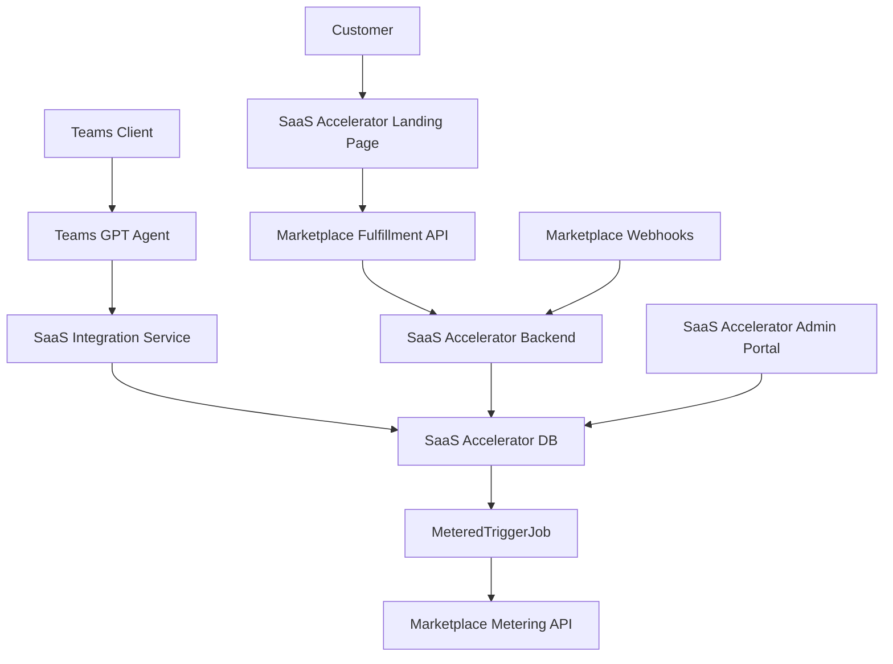

# Documentation Architecture - Teams GPT SaaS Marketplace

## Vue d'ensemble

Cette documentation décrit l'architecture pour transformer le projet Teams GPT Agent en solution SaaS transactionnelle sur Azure Marketplace, avec facturation basée sur le nombre de messages échangés.

**🚨 APPROCHE RECOMMANDÉE** : Utiliser le **Microsoft Commercial Marketplace SaaS Accelerator** existant plutôt que de recréer l'infrastructure from scratch.

## Structure de la documentation

### 📋 [Architecture SaaS Marketplace](./saas-marketplace-architecture.md)

Document principal d'architecture décrivant :

- Architecture actuelle vs. architecture cible
- Composants principaux et intégrations
- Modèle de données détaillé
- Plans tarifaires et dimensions de facturation
- Workflow de facturation et rapportage
- Infrastructure Azure requise
- Considérations de sécurité et conformité

### 🚀 [Plan d'implémentation](./implementation-plan.md)

Guide d'implémentation aligné avec les issues GitHub (#2, #3, #4, #5) en 4 phases :

- **Phase 1** : Déploiement SaaS Accelerator (Semaine 1)
- **Phase 2** : Intégration Teams GPT avec SaaS Accelerator (Semaine 2)
- **Phase 3** : Configuration Azure Marketplace et Certification (Semaine 3)
- **Phase 4** : Testing, Validation et Go-Live (Semaine 4)

### ⚡ [Intégration SaaS Accelerator](./saas-accelerator-integration.md) **APPROCHE RECOMMANDÉE**

**Solution retenue** utilisant le Microsoft Commercial Marketplace SaaS Accelerator :

- ✅ **Réutilisation de 80% de l'infrastructure** existante Microsoft
- ✅ **Intégration minimale** avec l'agent Teams GPT existant  
- ✅ **Déploiement en 4 semaines** au lieu de 6+ mois
- ✅ **Maintenance automatique** et updates Microsoft
- ✅ **Certification garantie** car templates Microsoft officiels

### 🔧 [Spécifications techniques](./technical-specifications.md)

**Documentation de référence** (approche alternative "from scratch") :

> ⚠️ **Note** : Ce document décrit l'approche complète "from scratch" à des fins de référence technique. **L'approche SaaS Accelerator est recommandée** pour ce projet.

- Composants détaillés si développés from scratch
- Schéma de base de données complet 
- APIs et services custom requis
- Configuration infrastructure complète
- Monitoring et télémétrie détaillés

## Architecture avec SaaS Accelerator

### Composants principaux

### Architecture hybride : Teams GPT + SaaS Accelerator

1. **✅ Fourni par SaaS Accelerator** : Landing pages, Admin portals, Webhooks, Facturation automatique
2. **🔧 À développer** : Service d'intégration Teams GPT avec SaaS Accelerator
3. **📝 Configuration** : Plans tarifaires, dimensions de mesure, metadata Marketplace

### Facturation basée sur les messages (alignée avec les issues GitHub)

#### Dimensions de facturation

- **Messages standards** : 0.01&euro;/message
- **Messages premium** : 0.02&euro;/message (avec pièces jointes, texte long >1000 caractères)

#### Plans proposés (conformes aux issues #2, #3, #4, #5)

| Plan | Prix mensuel | Messages inclus | Prix dépassement |
|------|-------------|------------------|------------------|
| Starter | 9.99&euro; | 1,000 | 0.01&euro;/message |
| Professional | 49.99&euro; | 10,000 | 0.008&euro;/message |
| Enterprise | 199.99&euro; | 50,000 | 0.005&euro;/message |

## Technologies utilisées (SaaS Accelerator)

### ✅ Infrastructure fournie par SaaS Accelerator

- **ASP.NET Core** - CustomerSite, AdminSite, WebHook
- **SQL Server** - Base de données avec schéma complet
- **Azure Functions** - MeteredTriggerJob pour facturation automatique
- **Key Vault** - Gestion automatique des secrets
- **Application Insights** - Monitoring intégré

### 🔧 Extension Teams GPT requise

- **Node.js** 20/22 - Runtime Teams GPT existant
- **Microsoft Teams AI Library** 2.0 - Framework bot (inchangé)
- **Azure OpenAI** - Traitement IA (inchangé)
- **SaaS Integration Service** - Pont vers SaaS Accelerator

### 🔗 APIs Marketplace (intégrées dans SaaS Accelerator)

- **SaaS Fulfillment API** v2 - Gestion automatique des abonnements
- **Marketplace Metering API** - Rapportage automatique d'usage

## Points d'attention

### Sécurité

- ✅ Authentification Azure AD pour toutes les APIs
- ✅ Chiffrement des données sensibles
- ✅ Gestion des secrets via Key Vault
- ✅ Audit trail complet des opérations

### Performance

- ✅ Traitement asynchrone du rapportage d'usage
- ✅ Cache des informations d'abonnement
- ✅ Optimisation des requêtes base de données
- ✅ Monitoring proactif avec alertes

### Conformité

- ✅ Conformité RGPD pour les données utilisateur
- ✅ Retention des données selon les exigences légales
- ✅ Logs d'audit pour toutes les opérations critiques

## Prochaines étapes

1. **Review architecture** avec l'équipe technique
2. **Validation business model** avec l'équipe produit
3. **Planification détaillée** des sprints de développement
4. **Configuration environnements** de développement et test
5. **Démarrage Phase 1** - Infrastructure et base de données

## Support et contact

Pour toute question sur cette architecture :

- **Documentation technique** : Voir `technical-specifications.md`
- **Planning détaillé** : Voir `implementation-plan.md`
- **Questions business** : Contacter l'équipe produit
- **Questions techniques** : Contacter l'équipe dev

**Cette documentation est maintenue à jour avec l'évolution du projet. Dernière mise à jour : Octobre 2025**
