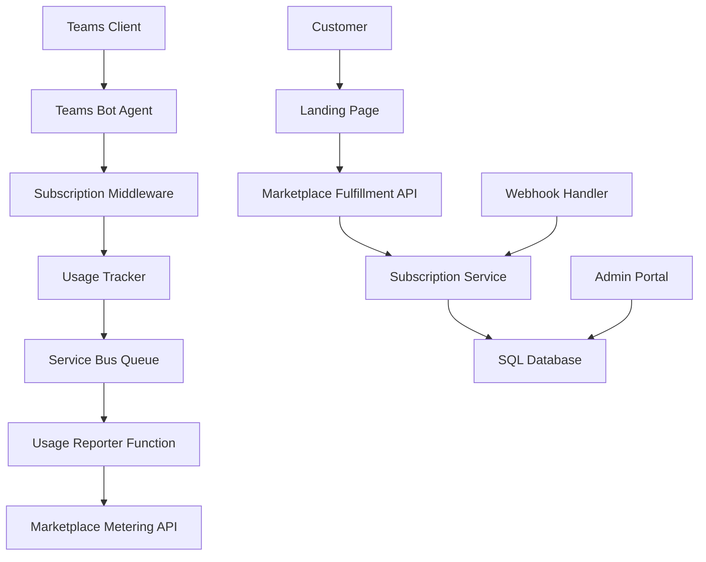

# Documentation Architecture - Teams GPT SaaS Marketplace

## Vue d'ensemble

Cette documentation décrit l'architecture pour transformer le projet Teams GPT Agent en solution SaaS transactionnelle sur Azure Marketplace, avec facturation basée sur le nombre de messages échangés.

**🚨 APPROCHE RECOMMANDÉE** : Utiliser le **Microsoft Commercial Marketplace SaaS Accelerator** existant plutôt que de recréer l'infrastructure from scratch.

## Structure de la documentation

### 📋 [Architecture SaaS Marketplace](./saas-marketplace-architecture.md)

Document principal d'architecture décrivant :

- Architecture actuelle vs. architecture cible
- Composants principaux et intégrations
- Modèle de données détaillé
- Plans tarifaires et dimensions de facturation
- Workflow de facturation et rapportage
- Infrastructure Azure requise
- Considérations de sécurité et conformité

### 🚀 [Plan d'implémentation](./implementation-plan.md)

Guide d'implémentation aligné avec les issues GitHub (#2, #3, #4, #5) en 4 phases :

- **Phase 1** : Déploiement SaaS Accelerator (Semaine 1)
- **Phase 2** : Intégration Teams GPT avec SaaS Accelerator (Semaine 2)
- **Phase 3** : Configuration Azure Marketplace et Certification (Semaine 3)
- **Phase 4** : Testing, Validation et Go-Live (Semaine 4)

### ⚡ [Intégration SaaS Accelerator](./saas-accelerator-integration.md) **RECOMMANDÉ**

Approche pragmatique utilisant le SaaS Accelerator Microsoft :

- Réutilisation de 80% de l'infrastructure existante
- Intégration minimale avec l'agent Teams GPT
- Déploiement en 4 semaines au lieu de 12
- Maintenance et updates automatiques

### 🔧 [Spécifications techniques](./technical-specifications.md)

Documentation technique complète (approche from scratch) :

- Composants détaillés avec code source
- Schéma de base de données complet
- APIs et services requis
- Configuration infrastructure Azure
- Monitoring et télémétrie
- Sécurité et gestion des secrets

## Architecture en un coup d'œil

### Composants principaux

### Flux de données clés

1. **Activation d'abonnement** : Customer → Landing Page → Fulfillment API → Subscription Service
2. **Usage tracking** : Teams Message → Bot Agent → Usage Tracker → Database
3. **Rapportage** : Service Bus → Usage Reporter → Metering API → Marketplace
4. **Gestion lifecycle** : Marketplace Webhook → Handler → Subscription Service

### Facturation basée sur les messages

#### Dimensions de facturation

- **Messages standards** : 0.01&euro;/message
- **Messages premium** : 0.02&euro;/message (avec pièces jointes, texte long)
- **Messages complexes** : Facturation proportionnelle aux tokens utilisés

#### Plans proposés

| Plan | Prix mensuel | Messages inclus | Prix dépassement |
|------|-------------|------------------|------------------|
| Starter | 9.99&euro; | 1,000 | 0.01&euro;/message |
| Professional | 49.99&euro; | 10,000 | 0.008&euro;/message |
| Enterprise | 199.99&euro; | 50,000 | 0.005&euro;/message |

## Technologies utilisées

### Backend
- **Node.js** 20/22 - Runtime principal
- **Microsoft Teams AI Library** 2.0 - Framework bot
- **Azure OpenAI** - Traitement IA
- **SQL Server** - Base de données principale
- **Service Bus** - Queue pour traitement asynchrone

### Azure Services
- **App Service** - Hébergement applications web
- **Azure Functions** - Traitement serverless
- **Key Vault** - Gestion sécurisée des secrets
- **Application Insights** - Monitoring et télémétrie
- **Service Bus** - Messaging asynchrone

### APIs Marketplace
- **SaaS Fulfillment API** v2 - Gestion des abonnements
- **Marketplace Metering Service API** - Rapportage d'usage

## Points d'attention

### Sécurité

- ✅ Authentification Azure AD pour toutes les APIs
- ✅ Chiffrement des données sensibles
- ✅ Gestion des secrets via Key Vault
- ✅ Audit trail complet des opérations

### Performance

- ✅ Traitement asynchrone du rapportage d'usage
- ✅ Cache des informations d'abonnement
- ✅ Optimisation des requêtes base de données
- ✅ Monitoring proactif avec alertes

### Conformité

- ✅ Conformité RGPD pour les données utilisateur
- ✅ Retention des données selon les exigences légales
- ✅ Logs d'audit pour toutes les opérations critiques

## Prochaines étapes

1. **Review architecture** avec l'équipe technique
2. **Validation business model** avec l'équipe produit
3. **Planification détaillée** des sprints de développement
4. **Configuration environnements** de développement et test
5. **Démarrage Phase 1** - Infrastructure et base de données

## Support et contact

Pour toute question sur cette architecture :

- **Documentation technique** : Voir `technical-specifications.md`
- **Planning détaillé** : Voir `implementation-plan.md`
- **Questions business** : Contacter l'équipe produit
- **Questions techniques** : Contacter l'équipe dev

---

*Cette documentation est maintenue à jour avec l'évolution du projet. Dernière mise à jour : Octobre 2025*