# Architecture Infrastructure Azure - DevOps & CI/CD

**Version** : 1.0  
**Date** : 12 novembre 2025  
**Auteur** : Architecture Team  
**Projet** : Teams GPT SaaS Accelerator

---

## 📋 Table des matières

1. [Vue d'ensemble](#vue-densemble)
2. [Architecture globale](#architecture-globale)
3. [Composants Azure](#composants-azure)
4. [Pipeline CI/CD](#pipeline-cicd)
5. [Environnements](#environnements)
6. [Réseau & Sécurité](#réseau--sécurité)
7. [Monitoring & Observabilité](#monitoring--observabilité)
8. [Disaster Recovery](#disaster-recovery)
9. [Coûts & Dimensionnement](#coûts--dimensionnement)
10. [Diagrammes techniques](#diagrammes-techniques)

---

## 🎯 Vue d'ensemble

### Objectifs de l'architecture

Cette architecture DevOps vise à fournir :

- ✅ **Déploiements automatisés** : CI/CD complet de dev à prod
- ✅ **Haute disponibilité** : 99.9% uptime avec Blue/Green deployment
- ✅ **Sécurité** : Secrets managés, scans automatiques, isolation réseau
- ✅ **Observabilité** : Monitoring temps réel, alertes proactives
- ✅ **Scalabilité** : Auto-scaling horizontal et vertical
- ✅ **Reproductibilité** : Infrastructure as Code (Bicep/Terraform)

### Principes de design

1. **Everything as Code** : Infrastructure, configuration, tests
2. **Immutable Infrastructure** : Containers déployés, jamais modifiés
3. **Security by Default** : Least privilege, secrets rotation, network isolation
4. **Observability First** : Logs, metrics, traces pour chaque composant
5. **Cost Optimization** : Auto-shutdown, reserved instances, right-sizing

---

## 🏗️ Architecture globale

### Diagramme de haut niveau


---

## 🧩 Composants Azure

### 1. **Resource Groups**

#### rg-teams-gpt-shared (Services partagés)

**Région** : Canada Central  

**Tags** : Environment=Shared, Project=Teams-GPT, ManagedBy=IaC

**Ressources** :

- **Azure Key Vault**
  - SKU : Standard
  - Soft delete : 90 jours
  - Purge protection : Activé
  - Secrets : Bot credentials, DB passwords, API keys
  - Access policies : Managed Identity uniquement

- **Azure Container Registry**
  - SKU : Standard
  - Geo-replication : Canada East (backup)
  - Content trust : Activé
  - Webhook : Notification deploy sur nouveau tag

- **Log Analytics Workspace**
  - Retention : 90 jours
  - Daily cap : 5 GB
  - Linked services : App Insights, App Services

#### rg-teams-gpt-dev (Développement)

**Région** : Canada Central

**Ressources** :

- **App Service Plan**
  - SKU : S1 Standard (1 core, 1.75 GB RAM)
  - OS : Linux
  - Reserved instance : Non
  - Auto-scale : Désactivé

- **App Service**
  - Runtime : Node.js 20 LTS
  - Always On : Activé
  - Health check : `/health`
  - Deployment slots : `production` (actif), `staging` (pour blue/green)
  - Managed Identity : System-assigned
  - Application Settings : Références Key Vault pour secrets (bot credentials, connection strings)

- **Azure SQL Database**
  - Tier : Standard S0 (10 DTU)
  - Backup : Point-in-time restore 7 jours
  - Geo-replication : Non
  - Firewall : Azure services + CI/CD runner IP
  - Connection pooling : Activé (max 100)

- **Application Insights**
  - Type : Node.js
  - Sampling : 100% (dev)
  - Retention : 30 jours
  - Alertes : Response time, Error rate, Dependency failures

#### rg-teams-gpt-prod (Production)

**Région** : Canada Central  
**Backup Region** : Canada East

**Ressources** :

- **App Service Plan**
  - SKU : P1v3 Premium (2 cores, 8 GB RAM)
  - Auto-scale : 2-10 instances basé sur CPU et queue length

- **App Service**
  - Runtime : Node.js 20 LTS
  - Deployment slots : `production`, `staging`
  - Traffic routing : 100% production (swap après validation staging)
  - HTTPS only : Activé, TLS 1.2 minimum
  - CORS : teams.microsoft.com uniquement

- **Azure SQL Database**
  - Tier : Standard S1 (20 DTU)
  - Active geo-replication : Canada East
  - Backup : Point-in-time restore 35 jours
  - Advanced Threat Protection : Activé
  - Auditing : Activé → Log Analytics

- **Application Insights**
  - Sampling : 10% (optimisation coûts)
  - Retention : 90 jours
  - Alertes critiques : Availability, Response time, Exception rate, Dependencies

#### rg-saas-accelerator (SaaS Marketplace)

**Note** : Existant, géré séparément

---

## 🔄 Pipeline CI/CD

### Architecture du Pipeline

```mermaid
graph TB
    subgraph Triggers["⚡ Triggers"]
        Push["Push main/develop"]
        PR["Pull Request"]
        Tag["Tag v*"]
        Manual["Manual"]
    end

    subgraph Stage1["📦 Build & Test<br/>(5-8 min)"]
        S1_1["Checkout & Setup"]
        S1_2["npm ci & cache"]
        S1_3["Lint & Tests"]
        S1_4["Coverage Report"]
    end

    subgraph Stage2["🔒 Security Scan<br/>(3-5 min)"]
        S2_1["Snyk Scan"]
        S2_2["npm audit"]
        S2_3["CodeQL SAST"]
        S2_4["SARIF Report"]
    end

    subgraph Stage3["🎁 Build Artifact<br/>(2-3 min)"]
        S3_1["npm build"]
        S3_2["Create Package"]
        S3_3["Upload Artifact"]
    end

    subgraph DeployDev["🚀 Deploy DEV<br/>(Auto - 3-4 min)"]
        D1["Deploy Staging"]
        D2["Health Check"]
        D3["Swap Slots"]
        D4["Notify"]
    end

    subgraph DeployProd["🚀 Deploy PROD<br/>(Manual - 8-10 min)"]
        P1["Deploy Staging"]
        P2["Smoke Tests"]
        P3["⏸ APPROVAL"]
        P4["Swap Production"]
        P5["Monitor 5min"]
        P6["Notify"]
    end

    Triggers --> Stage1
    S1_1 --> S1_2 --> S1_3 --> S1_4
    
    Stage1 --> Stage2
    S2_1 --> S2_2 --> S2_3 --> S2_4
    
    Stage2 --> Stage3
    S3_1 --> S3_2 --> S3_3
    
    Stage3 --> DeployDev
    Stage3 --> DeployProd
    
    D1 --> D2 --> D3 --> D4
    P1 --> P2 --> P3 --> P4 --> P5 --> P6
```



### Workflow Files

#### `.github/workflows/ci-cd.yml` (Exemple illustratif)

**Note**: Voir le fichier complet dans le repository pour l'implémentation détaillée.

```yaml
name: CI/CD Pipeline

on:
  push:
    branches: [main, develop]
  pull_request:
  workflow_dispatch:

env:
  NODE_VERSION: '20.x'

jobs:
  build-and-test:
    runs-on: ubuntu-latest
    steps:
      - uses: actions/checkout@v4
      - uses: actions/setup-node@v4
        with:
          node-version: '20.x'
          cache: 'npm'
      
      - run: npm ci
      - run: npm run lint
      - run: npm run test:unit
      - run: npm run test:integration
      - run: npm run test:coverage
      
      - uses: codecov/codecov-action@v3
        with:
          files: ./coverage/lcov.info
      
      - name: Create deployment package
        run: |
          # Création du package de déploiement
          # Exclusion: tests/, .git/, *.md, doc/
          # Production dependencies uniquement
          ...
      
      - uses: actions/upload-artifact@v4
        with:
          name: bot-package
          retention-days: 30

  security-scan:
    runs-on: ubuntu-latest
    needs: build-and-test
    steps:
      - uses: snyk/actions/node@master
      - run: npm audit --audit-level=high
      - uses: github/codeql-action/init@v2
      - uses: github/codeql-action/analyze@v2

  deploy-dev:
    runs-on: ubuntu-latest
    needs: [build-and-test, security-scan]
    if: github.ref == 'refs/heads/main'
    environment: development
    steps:
      - uses: azure/login@v1
        with:
          creds: ${{ secrets.AZURE_CREDENTIALS_DEV }}
      
      - uses: azure/webapps-deploy@v2
        with:
          app-name: bot-teamsgpt-dev
          slot-name: staging
      
      - name: Health check & Swap
        run: |
          # Health check staging
          # Swap staging → production
          # Smoke test production
          # Notify Slack
          ...

  deploy-prod:
    runs-on: ubuntu-latest
    needs: [build-and-test, security-scan]
    if: startsWith(github.ref, 'refs/tags/v')
    environment: production
    steps:
      - uses: azure/login@v1
        with:
          creds: ${{ secrets.AZURE_CREDENTIALS_PROD }}
      
      - uses: azure/webapps-deploy@v2
        with:
          app-name: bot-teamsgpt-prod
          slot-name: staging
      
      - name: Smoke tests
        run: npm run test:smoke
      
      - name: ⏸ Manual Approval
        uses: trstringer/manual-approval@v1
        with:
          approvers: devops-team
          minimum-approvals: 1
      
      - name: Swap to production & Monitor
        run: |
          # Swap staging → production
          # Monitor health 5 minutes
          # Rollback automatique si échec
          # Create GitHub Release
          # Notify Slack
          ...
```

---

## 🌍 Environnements

### Stratégie Multi-environnements

```
Developer Workstation
        ↓
    [LOCAL]  ← docker-compose up
        ↓ (git push origin feature/*)
    [DEV]    ← Auto deploy on PR merge to main
        ↓ (Manual promote / Tag creation)
    [STAGING] ← Slot on PROD, validation manuelle
        ↓ (Manual approval)
    [PROD]   ← Blue/Green swap
```

### Configuration par environnement

| Aspect | Local | Dev | Prod |
|--------|-------|-----|------|
| **URL** | localhost:3978 | bot-dev.azurewebsites.net | bot-prod.azurewebsites.net |
| **App Service Plan** | N/A | S1 (1 core, 1.75GB) | P1v3 (2 cores, 8GB) |
| **Auto-scale** | Non | Non | Oui (2-10 instances) |
| **SQL Tier** | Docker local | Standard S0 (10 DTU) | Standard S1 (20 DTU) |
| **Geo-replication** | Non | Non | Oui (Canada East) |
| **Always On** | N/A | Oui | Oui |
| **Deployment Slots** | N/A | staging | staging |
| **App Insights Sampling** | 100% | 100% | 10% |
| **Log Retention** | N/A | 30 jours | 90 jours |
| **Backup** | N/A | 7 jours PITR | 35 jours PITR |
| **SSL/TLS** | Non | Oui (managed cert) | Oui (managed cert) |
| **Secrets** | .env files | Key Vault | Key Vault |
| **Cost (monthly)** | 0$ | ~150$ | ~500$ |

---

## 🔐 Réseau & Sécurité

### Architecture réseau

```
┌─────────────────────────────────────────────────────────────────┐
│                    INTERNET (Public)                            │
│                           ↓                                     │
│  ┌─────────────────────────────────────────────────────────┐   │
│  │  Azure Front Door / Application Gateway                 │   │
│  │  * WAF Rules (OWASP Top 10)                             │   │
│  │  * DDoS Protection Standard                             │   │
│  │  * SSL/TLS termination                                  │   │
│  └──────────────────────┬──────────────────────────────────┘   │
│                         │                                       │
└─────────────────────────┼───────────────────────────────────────┘
                          │
              ┌───────────┴────────────┐
              │                        │
              ▼                        ▼
    ┌──────────────────┐    ┌──────────────────┐
    │  App Service     │    │  App Service     │
    │  (Dev/Prod)      │    │  (SaaS Portal)   │
    │                  │    │                  │
    │  VNet Injection  │    │  VNet Injection  │
    └────────┬─────────┘    └────────┬─────────┘
             │                       │
    ┌────────┴───────────────────────┴────────┐
    │       Private Endpoints                 │
    │  ┌──────────┐  ┌──────────┐            │
    │  │ Key      │  │ SQL DB   │            │
    │  │ Vault    │  │ (Private)│            │
    │  └──────────┘  └──────────┘            │
    └─────────────────────────────────────────┘
```

### Sécurité des secrets

**Azure Key Vault** : Source de vérité unique

| Secret | Nom Key Vault | Rotation |
|--------|---------------|----------|
| Bot App Secret | `bot-app-secret-dev` | 90 jours |
| Bot App Secret (prod) | `bot-app-secret-prod` | 90 jours |
| SQL Password Dev | `sql-password-dev` | 60 jours |
| SQL Password Prod | `sql-password-prod` | 60 jours |
| OpenAI API Key | `openai-api-key` | Manuelle |
| SaaS DB Connection | `saas-db-connection-string` | 60 jours |

**Accès Key Vault** :
- App Service (Dev) : System Managed Identity → Get secrets
- App Service (Prod) : System Managed Identity → Get secrets
- GitHub Actions : Service Principal → Get secrets (dev/prod séparés)
- Administrateurs : Conditional Access + MFA requis

### Network Security Groups

```bicep
// NSG pour App Services
resource nsg 'Microsoft.Network/networkSecurityGroups@2023-04-01' = {
  name: 'nsg-teams-bot'
  location: location
  properties: {
    securityRules: [
      {
        name: 'AllowHTTPS'
        properties: {
          priority: 100
          direction: 'Inbound'
          access: 'Allow'
          protocol: 'Tcp'
          sourcePortRange: '*'
          destinationPortRange: '443'
          sourceAddressPrefix: 'Internet'
          destinationAddressPrefix: '*'
        }
      }
      {
        name: 'AllowAppInsights'
        properties: {
          priority: 110
          direction: 'Outbound'
          access: 'Allow'
          protocol: 'Tcp'
          sourcePortRange: '*'
          destinationPortRange: '443'
          sourceAddressPrefix: '*'
          destinationAddressPrefix: 'ApplicationInsights'
        }
      }
      {
        name: 'DenyAllInbound'
        properties: {
          priority: 4096
          direction: 'Inbound'
          access: 'Deny'
          protocol: '*'
          sourcePortRange: '*'
          destinationPortRange: '*'
          sourceAddressPrefix: '*'
          destinationAddressPrefix: '*'
        }
      }
    ]
  }
}
```

### Managed Identities

| Service | Identity Type | Permissions |
|---------|--------------|-------------|
| bot-teamsgpt-dev | System-assigned | Key Vault Reader, SQL DB Contributor |
| bot-teamsgpt-prod | System-assigned | Key Vault Reader, SQL DB Contributor |
| GitHub Actions (dev) | Service Principal | Resource Group Contributor (dev only) |
| GitHub Actions (prod) | Service Principal | Resource Group Contributor (prod only) |

---

## 📊 Monitoring & Observabilité

### Stack de monitoring

```
┌───────────────────────────────────────────────────────────────┐
│                    Application Layer                          │
│  ┌──────────────┐  ┌──────────────┐  ┌──────────────┐       │
│  │  App Service │  │  App Service │  │    SQL DB    │       │
│  │    (Bot)     │  │   (Portal)   │  │              │       │
│  └──────┬───────┘  └──────┬───────┘  └──────┬───────┘       │
│         │                 │                  │               │
│         └─────────────────┴──────────────────┘               │
│                           │                                  │
│                           ▼                                  │
│         ┌──────────────────────────────────┐                │
│         │   Application Insights           │                │
│         │   * Traces (requests, deps)      │                │
│         │   * Metrics (custom events)      │                │
│         │   * Exceptions                   │                │
│         │   * Live Metrics Stream          │                │
│         └──────────────┬───────────────────┘                │
│                        │                                     │
└────────────────────────┼─────────────────────────────────────┘
                         │
                         ▼
         ┌──────────────────────────────────┐
         │    Log Analytics Workspace       │
         │    * Kusto queries               │
         │    * 90 days retention           │
         │    * 5 GB daily cap              │
         └──────────────┬───────────────────┘
                        │
        ┌───────────────┴────────────────┐
        │                                │
        ▼                                ▼
┌────────────────┐            ┌────────────────┐
│ Azure Monitor  │            │   Grafana      │
│ Alerts         │            │   Dashboard    │
│ * Email        │            │   * Business   │
│ * Slack        │            │     metrics    │
│ * PagerDuty    │            │   * Custom viz │
└────────────────┘            └────────────────┘
```

### Métriques clés (KPIs)

#### Availability & Performance
- **Uptime** : Cible 99.9% (43.2 minutes downtime/mois)
- **Response Time P50** : < 500ms
- **Response Time P95** : < 2s
- **Response Time P99** : < 5s
- **Failed Requests** : < 0.1%

#### Business Metrics
- **Messages per hour** : Suivi en temps réel
- **Active subscriptions** : Count distinct
- **Metering events** : Taux de succès > 99%
- **Subscription lookups** : Latency < 100ms
- **OpenAI API calls** : Latency, errors, tokens used

#### Infrastructure
- **CPU Usage** : Alert si > 80% pendant 5 min
- **Memory Usage** : Alert si > 85%
- **SQL DTU** : Alert si > 90%
- **App Service HTTP Queue** : Alert si > 50

### Alertes configurées

```yaml
# Azure Monitor Alert Rules
alerts:
  - name: High Error Rate
    condition: exceptions/server | where timestamp > ago(5m) | count > 10
    severity: Critical
    action: PagerDuty + Slack
  
  - name: Slow Response Time
    condition: requests | where duration > 5000 and timestamp > ago(5m) | count > 5
    severity: Warning
    action: Slack
  
  - name: Database Connection Failures
    condition: dependencies | where type == "SQL" and success == false | count > 3
    severity: Critical
    action: PagerDuty + Slack
  
  - name: High CPU Usage
    condition: performanceCounters | where category == "Processor" and counter == "% Processor Time" and value > 80
    severity: Warning
    action: Email + Slack
  
  - name: Low Availability
    condition: availabilityResults | where success == false | count > 2
    severity: Critical
    action: PagerDuty
```

### Dashboards

#### Dashboard Opérationnel (Azure Portal)
- **Availability** : Uptime chart 24h
- **Performance** : Response time P50/P95/P99
- **Errors** : Exception count by type
- **Traffic** : Requests per minute
- **Infrastructure** : CPU, Memory, DTU

#### Dashboard Business (Grafana)
- **Subscriptions actifs** : Gauge + trend
- **Messages traités** : Counter + rate
- **Coût par message** : Breakdown par dimension
- **Top utilisateurs** : Leaderboard
- **Revenus estimés** : Based on metering

---

## 🔄 Disaster Recovery & Business Continuity

### RTO & RPO Objectives

| Environnement | RTO (Recovery Time Objective) | RPO (Recovery Point Objective) |
|---------------|-------------------------------|--------------------------------|
| **Dev** | 4 heures | 24 heures |
| **Prod** | 15 minutes | 5 minutes |

### Stratégie de backup

#### Azure SQL Database
- **Point-in-time restore** :
  - Dev : 7 jours
  - Prod : 35 jours
- **Geo-replication** (Prod uniquement) :
  - Primary : Canada Central
  - Secondary : Canada East
  - Automatic failover group : Activé

#### App Service
- **Deployment slots** : Rollback instantané (swap inverse)
- **GitHub Artifacts** : Rétention 90 jours
- **Container Registry** : Images taggées, rétention infinie

#### Configuration & Secrets
- **Key Vault** :
  - Soft delete : 90 jours
  - Purge protection : Activé
- **IaC (Bicep)** :
  - Versionné dans Git
  - Déploiement reproductible

### Procédure de rollback

#### Rollback App Service (< 2 minutes)
```bash
# Swap inverse (production → staging)
az webapp deployment slot swap \
  --name bot-teamsgpt-prod \
  --resource-group rg-teams-gpt-prod \
  --slot production \
  --target-slot staging

# Vérifier health
curl -f https://bot-teamsgpt-prod.azurewebsites.net/health
```

#### Restore SQL Database (< 15 minutes)
```bash
# Point-in-time restore
az sql db restore \
  --resource-group rg-teams-gpt-prod \
  --server sql-teamsgpt-prod \
  --name AMPSaaSDB \
  --dest-name AMPSaaSDB-restored \
  --time "2025-11-12T10:30:00Z"

# Update connection string in Key Vault
az keyvault secret set \
  --vault-name kv-teamsgpt-shared \
  --name "sql-connection-string-prod" \
  --value "Server=tcp:sql-teamsgpt-prod.database.windows.net;Database=AMPSaaSDB-restored;..."
```

#### Failover SQL to Secondary Region (< 5 minutes)
```bash
# Automatic failover (pre-configured)
# Monitored by Azure, triggers automatically si primary down > 1 minute

# Manuel trigger (if needed)
az sql failover-group set-primary \
  --resource-group rg-teams-gpt-prod \
  --server sql-teamsgpt-prod \
  --name fog-teamsgpt-prod \
  --failover-policy Automatic
```

### Runbooks d'incident

#### Incident 1 : App Service Down
1. Vérifier Azure Status Dashboard
2. Consulter Application Insights Failures
3. Si erreur déploiement : Rollback slot swap
4. Si erreur infrastructure : Redémarrer App Service
5. Si échec : Escalader à Microsoft Support (Severity A)

#### Incident 2 : SQL Database Unreachable
1. Vérifier Azure SQL Status
2. Consulter DTU metrics (si 100% → scale up)
3. Vérifier firewall rules & NSG
4. Si régional outage : Trigger failover to secondary
5. Si corruption : Restore from point-in-time

#### Incident 3 : High Error Rate
1. Consulter Live Metrics Stream (App Insights)
2. Identifier pattern (OpenAI timeout ? DB deadlock ?)
3. Si external dependency : Activer circuit breaker
4. Si code bug : Rollback dernier déploiement
5. Post-mortem : Root Cause Analysis dans 48h

---

## 💰 Coûts & Dimensionnement

### Coûts mensuels estimés

#### Environnement DEV
| Ressource | SKU/Tier | Coût mensuel (USD) |
|-----------|----------|-------------------|
| App Service Plan S1 | 1 instance | $73 |
| Azure SQL S0 | 10 DTU | $15 |
| Application Insights | 5 GB/mois | $12 |
| Key Vault (shared) | Standard | $1 |
| Log Analytics (shared) | 2 GB/mois | $5 |
| **Total DEV** | | **~$106/mois** |

#### Environnement PROD
| Ressource | SKU/Tier | Coût mensuel (USD) |
|-----------|----------|-------------------|
| App Service Plan P1v3 | 2-10 instances (avg 3) | $292 |
| Azure SQL S1 + Geo-rep | 20 DTU x2 | $60 |
| Application Insights | 20 GB/mois (10% sampling) | $48 |
| Azure Front Door | Standard tier | $35 |
| DDoS Protection | Standard | $2,944 |
| Backup Storage | 100 GB | $10 |
| **Total PROD** | | **~$3,389/mois** |

#### Services Partagés
| Ressource | Coût mensuel (USD) |
|-----------|-------------------|
| Azure Container Registry | $5 |
| Key Vault (transactions) | $3 |
| Log Analytics Workspace | $10 |
| GitHub Actions (minutes) | $0 (inclus) |
| **Total Shared** | **~$18/mois** |

**TOTAL GLOBAL** : **~$3,513/mois** (Dev + Prod + Shared)

### Optimisations de coûts

1. **Reserved Instances** : -30% sur App Service Plan (commit 1 an)
2. **Auto-shutdown** : Dev App Service éteint 18h-8h (-40% coûts dev)
3. **SQL DTU Right-sizing** : Analyser métriques mensuelles
4. **App Insights Sampling** : 10% en prod (vs 100%)
5. **Log retention** : 30j dev, 90j prod (vs 730j max)

**Économies potentielles** : **~$800/mois** (23%)

### Scaling Strategy

#### App Service Auto-scaling Rules
```bicep
resource autoScaleSettings 'Microsoft.Insights/autoscalesettings@2022-10-01' = {
  name: 'autoscale-bot-prod'
  location: location
  properties: {
    enabled: true
    targetResourceUri: appServicePlan.id
    profiles: [
      {
        name: 'Default'
        capacity: {
          minimum: '2'
          maximum: '10'
          default: '2'
        }
        rules: [
          {
            metricTrigger: {
              metricName: 'CpuPercentage'
              operator: 'GreaterThan'
              threshold: 70
              timeAggregation: 'Average'
              timeWindow: 'PT5M'
            }
            scaleAction: {
              direction: 'Increase'
              type: 'ChangeCount'
              value: '1'
              cooldown: 'PT5M'
            }
          }
          {
            metricTrigger: {
              metricName: 'CpuPercentage'
              operator: 'LessThan'
              threshold: 30
              timeAggregation: 'Average'
              timeWindow: 'PT10M'
            }
            scaleAction: {
              direction: 'Decrease'
              type: 'ChangeCount'
              value: '1'
              cooldown: 'PT10M'
            }
          }
          {
            metricTrigger: {
              metricName: 'HttpQueueLength'
              operator: 'GreaterThan'
              threshold: 50
              timeAggregation: 'Average'
              timeWindow: 'PT5M'
            }
            scaleAction: {
              direction: 'Increase'
              type: 'ChangeCount'
              value: '2'
              cooldown: 'PT5M'
            }
          }
        ]
      }
      {
        name: 'Peak Hours'
        capacity: {
          minimum: '4'
          maximum: '10'
          default: '4'
        }
        recurrence: {
          frequency: 'Week'
          schedule: {
            timeZone: 'Eastern Standard Time'
            days: ['Monday', 'Tuesday', 'Wednesday', 'Thursday', 'Friday']
            hours: [9]
            minutes: [0]
          }
        }
      }
    ]
  }
}
```

---

## 📐 Diagrammes techniques

### Diagramme de déploiement (Deployment Diagram)

```mermaid
graph TB
    subgraph Developer["👨‍💻 Developer"]
        VSCode["VS Code Local"]
        GitHub["GitHub Repository"]
        VSCode -->|git push| GitHub
    end
    
    subgraph CICD["⚙️ GitHub Actions Runner"]
        Build["npm ci<br/>npm test<br/>npm lint<br/>zip package"]
        GitHub -->|webhook trigger| Build
    end
    
    Build -->|deploy| DevEnv
    Build -->|deploy| ProdEnv
    
    subgraph DevEnv["Development Environment"]
        DevStaging["Staging Slot"]
        DevProd["Production Slot"]
        DevStaging -->|swap| DevProd
    end
    
    subgraph ProdEnv["Production Environment"]
        ProdStaging["Staging Slot"]
        ProdProd["Production Slot"]
        ProdStaging -->|swap| ProdProd
    end
    
    DevProd --> AzureSQL
    ProdProd --> AzureSQL
    DevProd --> KeyVault
    ProdProd --> KeyVault
    
    AzureSQL[("Azure SQL<br/>Database")]
    KeyVault[("Key Vault<br/>Secrets")]
```



### Flux de données (Data Flow)

```mermaid
graph TB
    User["👤 Teams User"] -->|HTTPS 443<br/>Bot Framework Protocol| Teams["Microsoft Teams<br/>teams.microsoft.com"]
    
    Teams --> BotService["Azure Bot Service<br/>🔐 Authentication<br/>📬 Message routing"]
    
    BotService --> AppService
    
    subgraph AppService["App Service Node.js Bot"]
        Activity["1. Receive activity"] --> Middleware
        Middleware["2. subscriptionCheckMiddleware<br/>3. usageTrackingMiddleware"] --> AIHandler["4. AI Handler<br/>Teams AI Library"]
    end
    
    AIHandler --> SQL
    AIHandler --> KeyVault
    AIHandler --> OpenAI
    
    SQL[("Azure SQL<br/>Subscriptions<br/>MeteredDimensions<br/>Messages")]
    KeyVault[("Azure Key Vault<br/>Bot credentials<br/>DB passwords")]
    OpenAI["Azure OpenAI<br/>GPT-4"]
    
    SQL --> AppInsights
    OpenAI --> AppInsights
    
    AppInsights["📊 Application Insights<br/>Request telemetry<br/>Custom events<br/>Exceptions<br/>Dependencies"]
```



### Séquence de déploiement (Deployment Sequence)

```
Developer    GitHub       GitHub Actions    Azure DevOps    App Service    Health Check
    │             │               │               │              │              │
    │─git push───▶│               │               │              │              │
    │             │               │               │              │              │
    │             │─webhook──────▶│               │              │              │
    │             │               │               │              │              │
    │             │               │─checkout code─│              │              │
    │             │               │               │              │              │
    │             │               │─npm ci────────│              │              │
    │             │               │─npm test──────│              │              │
    │             │               │─npm lint──────│              │              │
    │             │               │─security scan─│              │              │
    │             │               │               │              │              │
    │             │               │─build package─│              │              │
    │             │               │               │              │              │
    │             │               │─login Azure───│              │              │
    │             │               │               │              │              │
    │             │               │─deploy staging│─────────────▶│              │
    │             │               │               │    (slot)    │              │
    │             │               │               │              │              │
    │             │               │───────────────────health check──────────────▶│
    │             │               │               │              │              │
    │             │               │◀───────────────────200 OK────────────────────│
    │             │               │               │              │              │
    │             │               │─swap slots────│──────────────▶              │
    │             │               │               │  (staging→   │              │
    │             │               │               │  production) │              │
    │             │               │               │              │              │
    │             │               │───────────────────smoke test─────────────────▶│
    │             │               │               │              │              │
    │             │               │◀───────────────────200 OK────────────────────│
    │             │               │               │              │              │
    │◀────notification (Slack)────│               │              │              │
    │   "Deployment SUCCESS"      │               │              │              │
    │             │               │               │              │              │
```

---

## 📚 Références & Ressources

### Documentation Microsoft
- [Azure App Service Best Practices](https://learn.microsoft.com/azure/app-service/best-practices)
- [Deployment Slots](https://learn.microsoft.com/azure/app-service/deploy-staging-slots)
- [Azure Key Vault](https://learn.microsoft.com/azure/key-vault/)
- [Application Insights](https://learn.microsoft.com/azure/azure-monitor/app/app-insights-overview)
- [GitHub Actions for Azure](https://learn.microsoft.com/azure/developer/github/github-actions)

### Templates IaC
- Repository : `/infra/azure.bicep`
- Parameters : `/infra/azure.parameters.json`
- CI/CD Workflows : `.github/workflows/`

### Runbooks
- Incident Response : `/doc/operations/incident-response.md`
- Deployment Guide : `/doc/operations/deployment-guide.md`
- Rollback Procedures : `/doc/operations/rollback-procedures.md`

---

## ✅ Checklist de validation

### Phase 1 : Infrastructure
- [ ] Resource groups créés (shared, dev, prod)
- [ ] Key Vault configuré avec secrets
- [ ] Managed Identities assignées
- [ ] Network Security Groups appliqués
- [ ] SQL Database provisionnée avec geo-replication (prod)
- [ ] Application Insights configuré

### Phase 2 : CI/CD
- [ ] Workflow GitHub Actions créé
- [ ] Secrets GitHub configurés
- [ ] Pipeline teste sur feature branch
- [ ] Déploiement automatique dev validé
- [ ] Déploiement manuel prod avec approval

### Phase 3 : Monitoring
- [ ] Application Insights instrumenté dans code
- [ ] Alertes configurées (email + Slack)
- [ ] Dashboard Azure créé
- [ ] Health check endpoint fonctionnel
- [ ] Logs centralisés dans Log Analytics

### Phase 4 : Sécurité
- [ ] Secrets dans Key Vault uniquement
- [ ] Managed Identity pour accès secrets
- [ ] HTTPS only + TLS 1.2 minimum
- [ ] Snyk scan activé dans pipeline
- [ ] CodeQL SAST scan activé

### Phase 5 : Production-ready
- [ ] Deployment slots configurés
- [ ] Auto-scaling activé (prod)
- [ ] Backup strategy validée
- [ ] Disaster Recovery testé
- [ ] Runbooks documentés

---

## 🚀 Prochaines étapes

### Actions immédiates (Semaine 1)
1. Créer resource groups Azure
2. Provisionner Key Vault et migrer secrets
3. Créer workflow GitHub Actions de base
4. Configurer Application Insights

### Court terme (Mois 1)
5. Implémenter blue/green deployment
6. Configurer auto-scaling production
7. Créer dashboards monitoring
8. Tester disaster recovery

### Moyen terme (Mois 2-3)
9. Optimiser coûts (reserved instances)
10. Améliorer observabilité (custom metrics)
11. Automatiser rotation secrets
12. Documentation runbooks

---

**Document maintenu par** : DevOps Team  
**Dernière mise à jour** : 12 novembre 2025  
**Version** : 1.0  
**Contact** : devops@cotechnoe.com

---

*Ce document est versionné dans Git et suit les mêmes processus de revue que le code.*
