```mermaid
sequenceDiagram
    participant A as Agent Teams GPT
    participant M as Middleware Usage
    participant C as MessageClassifier
    participant R as UsageReporter
    participant D as DB MeteredAuditLogs

    A->>M: Message traité avec succès
    M->>M: Extraire subscription du context
    M->>C: classifyMessage(messageData, subscription)
    C-->>M: dimension = "pro"
    M->>R: reportUsage(subscriptionId, "pro", 1, metadata)
    R->>R: formatUsageLog(params)
    R->>D: INSERT INTO MeteredAuditLogs
    D-->>R: Success
    R-->>M: void
    M->>A: Continue
    
    Note over D: MeteredTriggerJob (SaaS Accelerator)<br/>rapportera automatiquement à Marketplace
```

# Phase 2 : Intégration Teams GPT avec SaaS Accelerator

## Vue d'ensemble

Ce document décrit l'architecture détaillée de l'intégration entre l'agent Teams GPT existant et l'infrastructure SaaS Accelerator déployée en Phase 1. L'objectif est de créer un **pont transparent** entre les deux systèmes pour permettre la facturation metered basée sur l'usage des messages.

**Approche** : Extension minimale et non-intrusive de l'agent Teams GPT existant, en préservant sa structure et ses fonctionnalités tout en ajoutant les capacités SaaS.

---

## Architecture d'intégration

### Composants de la solution hybride

```mermaid
graph TB
    subgraph "Microsoft Teams"
        A[Teams Client]
    end
    
    subgraph "Agent Teams GPT (à modifier)"
        B[Teams Bot Service]
        C[app.js - Handler Messages]
        D[Subscription Middleware]
        E[Usage Tracking Middleware]
    end
    
    subgraph "Services d'intégration (à créer)"
        F[SaaSIntegrationService]
        G[MessageClassifier]
        H[UsageReporter]
    end
    
    subgraph "SaaS Accelerator (existant - Phase 1)"
        I[SQL Database]
        J[MeteredTriggerJob]
        K[Marketplace Metering API]
    end
    
    A --> B
    B --> D
    D --> C
    C --> E
    D --> F
    E --> F
    F --> G
    F --> H
    H --> I
    I --> J
    J --> K
    
    style D fill:#e1f5ff
    style E fill:#e1f5ff
    style F fill:#fff4e6
    style G fill:#fff4e6
    style H fill:#fff4e6
```



### Principe d'architecture

**🎯 Objectif** : Ajouter les capacités SaaS **sans modifier le comportement existant** de l'agent Teams GPT.

**✅ Approche "Middleware Pattern"** :
- Les middlewares interceptent les messages avant/après traitement
- Le code existant de l'agent reste intact
- Séparation claire des responsabilités (SoC)
- Facilité de maintenance et tests

---

## Composants à créer

### 1. Service d'intégration SaaS

#### 1.1 SaaSIntegrationService

**Localisation** : `src/services/saasIntegration.js`

**Responsabilités** :
- Connexion à la base de données SaaS Accelerator
- Vérification de l'état des abonnements
- Tracking de l'usage des messages
- Interface avec les tables SaaS Accelerator

**API publique** :

```javascript
class SaaSIntegrationService {
    /**
     * Récupère l'abonnement actif pour un utilisateur Teams
     * @param {string} teamsUserId - ID utilisateur Teams (activity.from.id)
     * @param {string} tenantId - ID tenant Azure AD (activity.from.aadObjectId)
     * @returns {Promise<Subscription|null>} Abonnement actif ou null
     */
    async getActiveSubscription(teamsUserId, tenantId)

    /**
     * Enregistre un événement d'usage de message pour facturation
     * @param {Subscription} subscription - Abonnement associé
     * @param {MessageData} messageData - Données du message
     * @returns {Promise<void>}
     */
    async trackMessageUsage(subscription, messageData)

    /**
     * Vérifie si l'utilisateur a atteint sa limite de messages
     * @param {string} subscriptionId - ID de l'abonnement
     * @param {string} currentPeriodStart - Date de début période actuelle
     * @returns {Promise<LimitStatus>} Statut des limites
     */
    async checkMessageLimit(subscriptionId, currentPeriodStart)

    /**
     * Récupère les statistiques d'usage pour l'utilisateur
     * @param {string} subscriptionId - ID de l'abonnement
     * @param {string} periodStart - Date de début de période
     * @returns {Promise<UsageStats>} Statistiques d'usage
     */
    async getUsageStats(subscriptionId, periodStart)
}
```

**Types de données** :

```javascript
/**
 * @typedef {Object} Subscription
 * @property {string} Id - ID unique de l'abonnement (GUID)
 * @property {string} AmpSubscriptionId - ID Azure Marketplace
 * @property {string} Name - Nom de l'abonnement
 * @property {string} PlanId - ID du plan tarifaire
 * @property {number} Quantity - Quantité (toujours 1 pour SaaS)
 * @property {string} SubscriptionStatus - Statut (Subscribed, Suspended, etc.)
 * @property {string} TeamsUserId - ID utilisateur Teams (extension Phase 2)
 * @property {string} TenantId - ID tenant Azure AD
 * @property {Date} CreateDate - Date de création
 * @property {Date} ModifyDate - Date de modification
 */

/**
 * @typedef {Object} MessageData
 * @property {string} text - Texte du message utilisateur
 * @property {string} response - Réponse de l'agent
 * @property {number} tokens - Nombre de tokens utilisés
 * @property {Array} attachments - Pièces jointes (si présentes)
 * @property {Date} timestamp - Horodatage du message
 * @property {string} conversationId - ID de la conversation Teams
 */

/**
 * @typedef {Object} LimitStatus
 * @property {boolean} isWithinLimit - Si l'utilisateur est dans sa limite
 * @property {number} currentUsage - Nombre de messages utilisés ce mois
 * @property {number} monthlyLimit - Limite mensuelle du plan
 * @property {number} remaining - Messages restants
 * @property {string} dimension - Dimension de facturation (free/pro/pro-plus)
 */

/**
 * @typedef {Object} UsageStats
 * @property {number} totalMessages - Total messages ce mois
 * @property {number} freeMessages - Messages dimension "free"
 * @property {number} proMessages - Messages dimension "pro"
 * @property {number} proPlusMessages - Messages dimension "pro-plus"
 * @property {Date} periodStart - Début de la période
 * @property {Date} lastMessageDate - Dernier message
 */
```

#### 1.2 MessageClassifier

**Localisation** : `src/services/messageClassifier.js`

**Responsabilités** :
- Classifier les messages selon les dimensions metered configurées
- Déterminer quelle dimension facturer (free/pro/pro-plus)
- Appliquer les règles métier de classification

**Logique de classification** :

```javascript
class MessageClassifier {
    /**
     * Détermine la dimension de facturation pour un message
     * @param {MessageData} messageData - Données du message
     * @param {Subscription} subscription - Abonnement de l'utilisateur
     * @returns {string} Dimension metered ('free', 'pro', ou 'pro-plus')
     */
    classifyMessage(messageData, subscription) {
        // Logique basée sur les dimensions Partner Center :
        // - free : 50 messages @ $0.02
        // - pro : 300 messages @ $0.015  
        // - pro-plus : 1500 messages @ $0.01
        
        // Règles de classification :
        const planDimensions = {
            'development': 'free',      // Plan gratuit illimité
            'starter': 'free',          // 50 messages gratuits
            'professional': 'pro',      // 300 messages
            'pro-plus': 'pro-plus'      // 1500 messages
        };
        
        return planDimensions[subscription.PlanId] || 'free';
    }

    /**
     * Vérifie si un message nécessite une classification spéciale
     * @param {MessageData} messageData - Données du message
     * @returns {Object} Métadonnées de classification
     */
    getMessageMetadata(messageData) {
        return {
            hasAttachments: messageData.attachments?.length > 0,
            isLongMessage: messageData.text?.length > 1000,
            tokenCount: messageData.tokens,
            conversationType: messageData.conversationId.includes('group') ? 'group' : '1:1'
        };
    }
}
```

**Règles de classification basées sur les plans Partner Center** :

| Plan | Dimension metered | Messages inclus | Coût par message |
|------|-------------------|-----------------|------------------|
| Development | `free` | Illimité | $0.00 (dev only) |
| Starter | `free` | 50 | $0.02 |
| Professional | `pro` | 300 | $0.015 |
| Pro Plus | `pro-plus` | 1500 | $0.01 |

#### 1.3 UsageReporter

**Localisation** : `src/services/usageReporter.js`

**Responsabilités** :
- Formatter les données d'usage pour la table MeteredAuditLogs
- Valider les données avant insertion
- Gérer les erreurs de rapportage

**API** :

```javascript
class UsageReporter {
    /**
     * Enregistre un événement d'usage dans MeteredAuditLogs
     * @param {string} subscriptionId - ID de l'abonnement
     * @param {string} dimension - Dimension metered
     * @param {number} quantity - Quantité (toujours 1 pour les messages)
     * @param {Object} metadata - Métadonnées additionnelles
     * @returns {Promise<void>}
     */
    async reportUsage(subscriptionId, dimension, quantity, metadata)

    /**
     * Formatte les données pour MeteredAuditLogs selon le schéma SaaS Accelerator
     * @param {Object} params - Paramètres d'usage
     * @returns {Object} Objet formatté pour insertion
     */
    formatUsageLog(params)
}
```

**Format des données pour MeteredAuditLogs** :

```javascript
{
    SubscriptionId: "12345678-1234-1234-1234-123456789abc",  // GUID de l'abonnement
    RequestJson: JSON.stringify({
        dimension: "pro",                                      // Dimension configurée dans Partner Center
        quantity: 1,                                          // Toujours 1 pour un message
        effectiveStartTime: "2025-10-30T14:23:45Z",          // ISO 8601
        teamsUserId: "29:1AbCdEfGhIjKlMnOpQrStUvWxYz",      // ID Teams (privacy)
        conversationId: "19:meeting_xyz123...",               // ID conversation (privacy)
        messageLength: 156,                                   // Longueur du message
        timestamp: "2025-10-30T14:23:45Z"                    // Horodatage
    }),
    StatusCode: "200",                                        // HTTP status
    CreatedDate: new Date(),                                  // Date d'insertion
    // ResponseJson sera peuplé par MeteredTriggerJob après rapportage
}
```

---

## Modifications de l'agent Teams GPT

### 2.1 Middleware de vérification d'abonnement

**Localisation** : `src/middleware/subscriptionCheck.js`

**Flux de traitement** :


**Implémentation** :

```javascript
// src/middleware/subscriptionCheck.js
const { SaaSIntegrationService } = require('../services/saasIntegration');

const saasIntegration = new SaaSIntegrationService();

/**
 * Middleware pour vérifier qu'un utilisateur a un abonnement actif
 * Bloque les messages si l'utilisateur n'est pas abonné
 */
async function subscriptionCheckMiddleware(context, next) {
    const teamsUserId = context.activity.from.id;
    const tenantId = context.activity.from.aadObjectId;

    try {
        const subscription = await saasIntegration.getActiveSubscription(teamsUserId, tenantId);

        if (!subscription) {
            // Pas d'abonnement trouvé
            await context.sendActivity({
                type: 'message',
                attachments: [{
                    contentType: 'application/vnd.microsoft.card.adaptive',
                    content: {
                        type: 'AdaptiveCard',
                        version: '1.4',
                        body: [
                            {
                                type: 'TextBlock',
                                text: '🔒 Abonnement requis',
                                weight: 'bolder',
                                size: 'large'
                            },
                            {
                                type: 'TextBlock',
                                text: 'Vous devez avoir un abonnement actif pour utiliser Teams GPT Assistant.',
                                wrap: true
                            },
                            {
                                type: 'TextBlock',
                                text: 'Choisissez un plan adapté à vos besoins :',
                                wrap: true,
                                spacing: 'medium'
                            },
                            {
                                type: 'FactSet',
                                facts: [
                                    { title: 'Starter', value: '50 messages gratuits' },
                                    { title: 'Professional', value: '300 messages - $9.99/mois' },
                                    { title: 'Pro Plus', value: '1500 messages - $49.99/mois' }
                                ]
                            }
                        ],
                        actions: [
                            {
                                type: 'Action.OpenUrl',
                                title: 'S\'abonner maintenant',
                                url: process.env.SAAS_PORTAL_URL
                            }
                        ]
                    }
                }]
            });
            return; // Arrêter le traitement (pas de next())
        }

        if (subscription.SubscriptionStatus !== 'Subscribed') {
            // Abonnement existe mais n'est pas actif
            const statusMessages = {
                'Suspended': 'Votre abonnement est suspendu. Veuillez contacter le support.',
                'Unsubscribed': 'Votre abonnement a été annulé. Réabonnez-vous pour continuer.',
                'PendingActivation': 'Votre abonnement est en cours d\'activation. Veuillez patienter.',
                'PendingFulfillmentStart': 'Votre abonnement est en cours de configuration.'
            };

            await context.sendActivity(
                statusMessages[subscription.SubscriptionStatus] || 
                'Votre abonnement n\'est pas actif actuellement.'
            );
            return; // Arrêter le traitement
        }

        // Abonnement actif - Attacher au context pour utilisation dans les handlers
        context.subscription = subscription;
        
        await next(); // Continuer vers le handler de messages

    } catch (error) {
        console.error('[SubscriptionCheck] Error:', error);
        await context.sendActivity('Une erreur est survenue lors de la vérification de votre abonnement.');
        // En cas d'erreur, on peut décider de bloquer ou laisser passer
        // Pour l'instant, on bloque par sécurité
    }
}

module.exports = { subscriptionCheckMiddleware };
```

### 2.2 Middleware de tracking d'usage

**Localisation** : `src/middleware/usageTracking.js`

**Flux de traitement** :



**Implémentation** :

```javascript
// src/middleware/usageTracking.js
const { MessageClassifier } = require('../services/messageClassifier');
const { UsageReporter } = require('../services/usageReporter');

const classifier = new MessageClassifier();
const reporter = new UsageReporter();

/**
 * Middleware pour tracker l'usage des messages après traitement
 * S'exécute APRÈS que l'agent ait répondu à l'utilisateur
 */
async function usageTrackingMiddleware(context, next) {
    // Laisser le handler de messages s'exécuter d'abord
    await next();

    // Après traitement du message, tracker l'usage
    try {
        const subscription = context.subscription; // Ajouté par subscriptionCheckMiddleware
        
        if (!subscription) {
            // Pas de subscription (ne devrait pas arriver si subscriptionCheckMiddleware fonctionne)
            console.warn('[UsageTracking] No subscription found in context');
            return;
        }

        // Construire les données du message
        const messageData = {
            text: context.activity.text,
            response: context.turnState?.get('lastResponse'), // Sera défini par le handler
            tokens: context.turnState?.get('tokenCount'),
            attachments: context.activity.attachments || [],
            timestamp: new Date(),
            conversationId: context.activity.conversation.id
        };

        // Classifier le message pour déterminer la dimension
        const dimension = classifier.classifyMessage(messageData, subscription);

        // Récupérer les métadonnées additionnelles
        const metadata = classifier.getMessageMetadata(messageData);

        // Rapporter l'usage
        await reporter.reportUsage(
            subscription.Id,
            dimension,
            1, // Toujours 1 message
            {
                ...metadata,
                teamsUserId: context.activity.from.id,
                conversationId: context.activity.conversation.id,
                planId: subscription.PlanId
            }
        );

        console.log(`[UsageTracking] Tracked message for subscription ${subscription.Id}, dimension: ${dimension}`);

    } catch (error) {
        console.error('[UsageTracking] Error tracking usage:', error);
        // Ne pas bloquer l'utilisateur en cas d'erreur de tracking
        // L'erreur sera loggée mais l'utilisateur aura déjà reçu sa réponse
    }
}

module.exports = { usageTrackingMiddleware };
```

### 2.3 Modifications dans app.js

**Localisation** : `src/app/app.js`

**Modifications minimales** à apporter au fichier existant :

```javascript
// src/app/app.js - MODIFICATIONS

// 1. Importer les nouveaux middlewares (AJOUTER au début)
const { subscriptionCheckMiddleware } = require('../middleware/subscriptionCheck');
const { usageTrackingMiddleware } = require('../middleware/usageTracking');

// ... code existant (création de l'app) ...

// 2. Enregistrer les middlewares AVANT le handler 'message' (AJOUTER)
app.use(subscriptionCheckMiddleware);
app.use(usageTrackingMiddleware);

// 3. Modifier le handler 'message' existant pour capturer les données de réponse
app.on('message', async ({ send, stream, activity }) => {
  const conversationKey = `${activity.conversation.id}/${activity.from.id}`;
  const messages = storage.get(conversationKey) || [];

  try {
    const prompt = new ChatPrompt({
      messages,
      instructions,
      model: new OpenAIChatModel({
        model: config.azureOpenAIDeploymentName,
        apiKey: config.azureOpenAIKey,
        endpoint: config.azureOpenAIEndpoint,
        apiVersion: "2024-10-21"
      })
    });

    if (activity.conversation.isGroup) {
      const response = await prompt.send(activity.text);
      
      // AJOUTER : Stocker la réponse et le nombre de tokens pour le tracking
      activity.turnState = activity.turnState || new Map();
      activity.turnState.set('lastResponse', response.content);
      activity.turnState.set('tokenCount', response.usage?.total_tokens || 0);
      
      const responseActivity = new MessageActivity(response.content)
        .addAiGenerated()
        .addFeedback();
      await send(responseActivity);
    } else {
      let fullResponse = '';
      await prompt.send(activity.text, {
        onChunk: (chunk) => {
          fullResponse += chunk;
          stream.emit(chunk);
        },
      });
      
      // AJOUTER : Stocker la réponse complète pour le tracking
      activity.turnState = activity.turnState || new Map();
      activity.turnState.set('lastResponse', fullResponse);
      activity.turnState.set('tokenCount', fullResponse.length / 4); // Approximation
      
      stream.emit(new MessageActivity().addAiGenerated().addFeedback());
    }
    
    storage.set(conversationKey, messages);
  } catch (error) {
    console.error(error);
    await send("The agent encountered an error or bug.");
    await send("To continue to run this agent, please fix the agent source code.");
  }
});

// ... reste du code existant ...
```

**Résumé des modifications dans app.js** :
- ✅ Ajout de 2 imports (middlewares)
- ✅ Enregistrement de 2 middlewares (2 lignes)
- ✅ Stockage de la réponse et tokens dans turnState (6 lignes)
- ❌ **Aucune modification** de la logique existante de l'agent

---

## Extension du modèle de données

### 3.1 Modifications de la base de données SaaS Accelerator

**Objectif** : Relier les abonnements Marketplace aux utilisateurs Teams.

**Script SQL à exécuter** :

```sql
-- Phase 2.3 : Extension du modèle de données
-- À exécuter sur la base de données SaaS Accelerator

USE [sac-02AMPSaaSDB]
GO

-- 1. Ajouter les colonnes Teams aux Subscriptions existantes
ALTER TABLE [dbo].[Subscriptions] 
ADD [TeamsUserId] NVARCHAR(255) NULL;

ALTER TABLE [dbo].[Subscriptions] 
ADD [TeamsConversationId] NVARCHAR(255) NULL;

ALTER TABLE [dbo].[Subscriptions] 
ADD [TenantId] NVARCHAR(255) NULL;

-- 2. Créer un index pour optimiser les recherches par TeamsUserId
CREATE NONCLUSTERED INDEX [IX_Subscriptions_TeamsUserId] 
ON [dbo].[Subscriptions] ([TeamsUserId])
INCLUDE ([Id], [SubscriptionStatus], [PlanId]);

-- 3. Créer un index pour les recherches par TenantId
CREATE NONCLUSTERED INDEX [IX_Subscriptions_TenantId] 
ON [dbo].[Subscriptions] ([TenantId])
INCLUDE ([Id], [SubscriptionStatus]);

-- 4. (OPTIONNEL) Table pour logs détaillés des conversations Teams
CREATE TABLE [dbo].[TeamsMessageLogs] (
    [Id] BIGINT IDENTITY(1,1) PRIMARY KEY,
    [SubscriptionId] UNIQUEIDENTIFIER NOT NULL,
    [TeamsUserId] NVARCHAR(255) NOT NULL,
    [ConversationId] NVARCHAR(255) NOT NULL,
    [MessageText] NVARCHAR(MAX) NULL,          -- Peut être NULL pour privacy
    [ResponseText] NVARCHAR(MAX) NULL,          -- Peut être NULL pour privacy
    [TokenCount] INT NULL,
    [Dimension] NVARCHAR(50) NOT NULL,          -- 'free', 'pro', 'pro-plus'
    [Timestamp] DATETIME2 NOT NULL DEFAULT GETUTCDATE(),
    [ProcessingTimeMs] INT NULL,
    [ConversationType] NVARCHAR(20) NULL,       -- '1:1' ou 'group'
    [HasAttachments] BIT NOT NULL DEFAULT 0,
    [MessageLength] INT NULL,
    
    CONSTRAINT [FK_TeamsMessageLogs_Subscriptions] 
        FOREIGN KEY ([SubscriptionId]) 
        REFERENCES [dbo].[Subscriptions]([Id])
        ON DELETE CASCADE
);

-- 5. Index pour TeamsMessageLogs
CREATE NONCLUSTERED INDEX [IX_TeamsMessageLogs_SubscriptionId_Timestamp] 
ON [dbo].[TeamsMessageLogs] ([SubscriptionId], [Timestamp] DESC);

CREATE NONCLUSTERED INDEX [IX_TeamsMessageLogs_TeamsUserId_Timestamp] 
ON [dbo].[TeamsMessageLogs] ([TeamsUserId], [Timestamp] DESC);

-- 6. Vue pour statistiques d'usage par abonnement
CREATE VIEW [dbo].[vw_SubscriptionUsageStats] AS
SELECT 
    s.Id AS SubscriptionId,
    s.AmpSubscriptionId,
    s.Name AS SubscriptionName,
    s.PlanId,
    s.SubscriptionStatus,
    s.TeamsUserId,
    COALESCE(COUNT(tml.Id), 0) AS TotalMessages,
    COALESCE(SUM(CASE WHEN tml.Dimension = 'free' THEN 1 ELSE 0 END), 0) AS FreeMessages,
    COALESCE(SUM(CASE WHEN tml.Dimension = 'pro' THEN 1 ELSE 0 END), 0) AS ProMessages,
    COALESCE(SUM(CASE WHEN tml.Dimension = 'pro-plus' THEN 1 ELSE 0 END), 0) AS ProPlusMessages,
    MAX(tml.Timestamp) AS LastMessageDate
FROM 
    [dbo].[Subscriptions] s
    LEFT JOIN [dbo].[TeamsMessageLogs] tml ON s.Id = tml.SubscriptionId
WHERE
    tml.Timestamp >= DATEADD(MONTH, DATEDIFF(MONTH, 0, GETUTCDATE()), 0) -- Mois actuel
    OR tml.Id IS NULL
GROUP BY 
    s.Id, s.AmpSubscriptionId, s.Name, s.PlanId, s.SubscriptionStatus, s.TeamsUserId;

GO

-- 7. Procédure stockée pour lier un utilisateur Teams à un abonnement
CREATE OR ALTER PROCEDURE [dbo].[sp_LinkTeamsUserToSubscription]
    @AmpSubscriptionId UNIQUEIDENTIFIER,
    @TeamsUserId NVARCHAR(255),
    @TenantId NVARCHAR(255),
    @ConversationId NVARCHAR(255) = NULL
AS
BEGIN
    SET NOCOUNT ON;
    
    UPDATE [dbo].[Subscriptions]
    SET 
        [TeamsUserId] = @TeamsUserId,
        [TenantId] = @TenantId,
        [TeamsConversationId] = @ConversationId,
        [ModifyDate] = GETUTCDATE()
    WHERE 
        [AmpSubscriptionId] = @AmpSubscriptionId;
    
    SELECT @@ROWCOUNT AS RowsAffected;
END
GO

PRINT 'Phase 2.3 : Extension du modèle de données - TERMINÉE'
PRINT 'Tables modifiées : Subscriptions'
PRINT 'Tables créées : TeamsMessageLogs (optionnel)'
PRINT 'Vues créées : vw_SubscriptionUsageStats'
PRINT 'Procédures créées : sp_LinkTeamsUserToSubscription'
```

### 3.2 Stratégie de liaison utilisateur ↔ abonnement

**Problème** : Comment associer un utilisateur Teams à un abonnement Marketplace ?

**Solutions possibles** :

#### Option 1 : Liaison manuelle via Admin Portal (RECOMMANDÉE pour Phase 2)

**Flux** :
1. Client achète sur Azure Marketplace
2. SaaS Accelerator crée l'abonnement
3. Admin ouvre le portail Admin (`sac-02-admin`)
4. Admin saisit le `TeamsUserId` de l'utilisateur
5. Procédure `sp_LinkTeamsUserToSubscription` fait la liaison

**Avantages** :
- ✅ Simple à implémenter
- ✅ Contrôle manuel par l'admin
- ✅ Pas de modification du flow Marketplace

**Inconvénients** :
- ❌ Liaison manuelle requise
- ❌ Pas automatique pour l'utilisateur final

#### Option 2 : Liaison automatique via Landing Page (FUTURE - Phase 3)

**Flux** :
1. Client achète sur Azure Marketplace
2. Redirigé vers Landing Page SaaS Accelerator
3. Landing Page demande authentification Microsoft (Azure AD)
4. Extraction du `TeamsUserId` depuis le token Azure AD
5. Liaison automatique dans la DB

**Avantages** :
- ✅ Totalement automatique
- ✅ Meilleure UX utilisateur

**Inconvénients** :
- ❌ Nécessite modification du Landing Page
- ❌ Plus complexe à implémenter
- ❌ Reporté à Phase 3

**➡️ Pour Phase 2, on utilise l'Option 1 (liaison manuelle)**

---

## Configuration et environnement

### 4.1 Variables d'environnement

**Fichier** : `env/.env.dev`

**Nouvelles variables à ajouter** :

```bash
# Phase 2 : Intégration SaaS Accelerator

# Connection string vers la base de données SaaS Accelerator
SAAS_DB_CONNECTION_STRING=Server=tcp:sac-02-sql.database.windows.net,1433;Initial Catalog=sac-02AMPSaaSDB;Persist Security Info=False;User ID=sqladmin;Password=<PASSWORD>;MultipleActiveResultSets=False;Encrypt=True;TrustServerCertificate=False;Connection Timeout=30;

# Configuration des dimensions metered (aligné avec Partner Center)
SAAS_DIMENSION_FREE=free
SAAS_DIMENSION_PRO=pro
SAAS_DIMENSION_PRO_PLUS=pro-plus

# Limites par plan (pour validation côté client)
SAAS_LIMIT_FREE=50
SAAS_LIMIT_PRO=300
SAAS_LIMIT_PRO_PLUS=1500

# Coûts par dimension (pour affichage)
SAAS_COST_FREE=0.02
SAAS_COST_PRO=0.015
SAAS_COST_PRO_PLUS=0.01

# Plans configurés dans Partner Center
SAAS_PLAN_DEVELOPMENT=development
SAAS_PLAN_STARTER=starter
SAAS_PLAN_PROFESSIONAL=professional
SAAS_PLAN_PRO_PLUS=pro-plus

# Activer les logs détaillés (true/false)
SAAS_ENABLE_MESSAGE_LOGS=false

# Activer le mode debug
SAAS_DEBUG_MODE=true
```

### 4.2 Fichier de configuration

**Fichier** : `src/config.js` (à étendre)

**Ajouts** :

```javascript
// src/config.js - AJOUTS pour Phase 2

module.exports = {
  // ... configuration existante ...

  // SaaS Accelerator Integration
  saas: {
    dbConnectionString: process.env.SAAS_DB_CONNECTION_STRING,
    
    dimensions: {
      free: process.env.SAAS_DIMENSION_FREE || 'free',
      pro: process.env.SAAS_DIMENSION_PRO || 'pro',
      proPlus: process.env.SAAS_DIMENSION_PRO_PLUS || 'pro-plus'
    },
    
    limits: {
      free: parseInt(process.env.SAAS_LIMIT_FREE) || 50,
      pro: parseInt(process.env.SAAS_LIMIT_PRO) || 300,
      proPlus: parseInt(process.env.SAAS_LIMIT_PRO_PLUS) || 1500
    },
    
    costs: {
      free: parseFloat(process.env.SAAS_COST_FREE) || 0.02,
      pro: parseFloat(process.env.SAAS_COST_PRO) || 0.015,
      proPlus: parseFloat(process.env.SAAS_COST_PRO_PLUS) || 0.01
    },
    
    plans: {
      development: process.env.SAAS_PLAN_DEVELOPMENT || 'development',
      starter: process.env.SAAS_PLAN_STARTER || 'starter',
      professional: process.env.SAAS_PLAN_PROFESSIONAL || 'professional',
      proPlus: process.env.SAAS_PLAN_PRO_PLUS || 'pro-plus'
    },
    
    enableMessageLogs: process.env.SAAS_ENABLE_MESSAGE_LOGS === 'true',
    debugMode: process.env.SAAS_DEBUG_MODE === 'true'
  }
};
```

---

## Sécurité et confidentialité

### 5.1 Gestion des données sensibles

**Principe** : Minimiser les données personnelles stockées (RGPD).

**Données à NE PAS stocker** :
- ❌ Contenu complet des messages utilisateur
- ❌ Réponses complètes de l'agent
- ❌ Noms d'utilisateurs
- ❌ Emails

**Données autorisées** :
- ✅ IDs anonymes (TeamsUserId, ConversationId)
- ✅ Métadonnées techniques (nombre de tokens, longueur)
- ✅ Compteurs d'usage
- ✅ Horodatages

**Implémentation dans UsageReporter** :

```javascript
// src/services/usageReporter.js
formatUsageLog(params) {
    // Anonymiser les données sensibles
    return {
        SubscriptionId: params.subscriptionId,
        RequestJson: JSON.stringify({
            dimension: params.dimension,
            quantity: params.quantity,
            effectiveStartTime: new Date().toISOString(),
            // Données anonymisées
            teamsUserIdHash: this.hashUserId(params.teamsUserId), // Hash au lieu de l'ID
            messageLength: params.messageLength,
            hasAttachments: params.hasAttachments,
            tokenCount: params.tokenCount,
            timestamp: params.timestamp.toISOString()
            // PAS de texte de message
        }),
        StatusCode: '200',
        CreatedDate: new Date()
    };
}

/**
 * Hash un ID utilisateur pour anonymisation
 * @param {string} userId - ID utilisateur Teams
 * @returns {string} Hash SHA256 de l'ID
 */
hashUserId(userId) {
    const crypto = require('crypto');
    return crypto.createHash('sha256').update(userId).digest('hex').substring(0, 16);
}
```

### 5.2 Authentification et autorisation

**Connexion à la DB SaaS Accelerator** :

**Option 1** : SQL Authentication (Phase 2 - Simple)
```javascript
const sql = require('mssql');

const config = {
    user: process.env.SAAS_DB_USER,
    password: process.env.SAAS_DB_PASSWORD,
    server: 'sac-02-sql.database.windows.net',
    database: 'sac-02AMPSaaSDB',
    options: {
        encrypt: true,
        trustServerCertificate: false
    }
};

const pool = await sql.connect(config);
```

**Option 2** : Managed Identity (Phase 3 - Recommandée)
```javascript
const { DefaultAzureCredential } = require('@azure/identity');
const sql = require('mssql');

const credential = new DefaultAzureCredential();
const token = await credential.getToken('https://database.windows.net/');

const config = {
    server: 'sac-02-sql.database.windows.net',
    database: 'sac-02AMPSaaSDB',
    authentication: {
        type: 'azure-active-directory-access-token',
        options: {
            token: token.token
        }
    },
    options: {
        encrypt: true
    }
};

const pool = await sql.connect(config);
```

**➡️ Pour Phase 2, utiliser Option 1 (SQL Auth)**

### 5.3 Chiffrement et secrets

**Secrets à protéger** :
- Connection string de la DB SaaS Accelerator
- Credentials SQL
- Clés API Azure OpenAI

**Solution** : Azure Key Vault (déjà déployé en Phase 1)

**Fichier** : `src/services/keyVaultService.js` (à créer)

```javascript
const { SecretClient } = require('@azure/keyvault-secrets');
const { DefaultAzureCredential } = require('@azure/identity');

class KeyVaultService {
    constructor() {
        const keyVaultUrl = process.env.SAAS_KEY_VAULT_URL || 
                           'https://sac-02-kv.vault.azure.net/';
        
        this.client = new SecretClient(
            keyVaultUrl,
            new DefaultAzureCredential()
        );
    }

    async getSecret(secretName) {
        try {
            const secret = await this.client.getSecret(secretName);
            return secret.value;
        } catch (error) {
            console.error(`Failed to retrieve secret ${secretName}:`, error);
            throw error;
        }
    }
}

module.exports = { KeyVaultService };
```

**Usage dans SaaSIntegrationService** :

```javascript
// src/services/saasIntegration.js
const { KeyVaultService } = require('./keyVaultService');

class SaaSIntegrationService {
    constructor() {
        this.keyVault = new KeyVaultService();
        this.initializeDatabase();
    }

    async initializeDatabase() {
        // Récupérer la connection string depuis Key Vault
        const connectionString = await this.keyVault.getSecret('saas-db-connection-string');
        // Initialiser la connexion SQL
        this.db = await sql.connect(connectionString);
    }
}
```

---

## Tests et validation

### 6.1 Tests unitaires

**Framework** : Jest

**Fichiers de tests à créer** :

```
tests/
├── unit/
│   ├── services/
│   │   ├── saasIntegration.test.js
│   │   ├── messageClassifier.test.js
│   │   └── usageReporter.test.js
│   └── middleware/
│       ├── subscriptionCheck.test.js
│       └── usageTracking.test.js
└── integration/
    └── saas-integration.test.js
```

**Exemple de test** :

```javascript
// tests/unit/services/messageClassifier.test.js
const { MessageClassifier } = require('../../../src/services/messageClassifier');

describe('MessageClassifier', () => {
    let classifier;

    beforeEach(() => {
        classifier = new MessageClassifier();
    });

    test('should classify development plan as free dimension', () => {
        const subscription = { PlanId: 'development' };
        const messageData = { text: 'Hello', attachments: [] };
        
        const dimension = classifier.classifyMessage(messageData, subscription);
        
        expect(dimension).toBe('free');
    });

    test('should classify professional plan as pro dimension', () => {
        const subscription = { PlanId: 'professional' };
        const messageData = { text: 'Hello', attachments: [] };
        
        const dimension = classifier.classifyMessage(messageData, subscription);
        
        expect(dimension).toBe('pro');
    });

    test('should detect message with attachments', () => {
        const messageData = { 
            text: 'Check this out', 
            attachments: [{ contentType: 'image/png' }] 
        };
        
        const metadata = classifier.getMessageMetadata(messageData);
        
        expect(metadata.hasAttachments).toBe(true);
    });

    test('should detect long messages', () => {
        const longText = 'a'.repeat(1500);
        const messageData = { text: longText, attachments: [] };
        
        const metadata = classifier.getMessageMetadata(messageData);
        
        expect(metadata.isLongMessage).toBe(true);
    });
});
```

### 6.2 Tests d'intégration

**Test de bout en bout** :

```javascript
// tests/integration/saas-integration.test.js
const { SaaSIntegrationService } = require('../../src/services/saasIntegration');
const sql = require('mssql');

describe('SaaS Integration - End to End', () => {
    let saasIntegration;
    let testSubscriptionId;

    beforeAll(async () => {
        saasIntegration = new SaaSIntegrationService();
        
        // Créer un abonnement de test
        const pool = await sql.connect(process.env.SAAS_DB_CONNECTION_STRING);
        const result = await pool.request()
            .input('teamsUserId', sql.NVarChar, 'test-user-123')
            .input('planId', sql.NVarChar, 'professional')
            .query(`
                INSERT INTO Subscriptions (AmpSubscriptionId, Name, PlanId, SubscriptionStatus, TeamsUserId)
                OUTPUT INSERTED.Id
                VALUES (NEWID(), 'Test Subscription', @planId, 'Subscribed', @teamsUserId)
            `);
        
        testSubscriptionId = result.recordset[0].Id;
    });

    afterAll(async () => {
        // Nettoyer l'abonnement de test
        const pool = await sql.connect(process.env.SAAS_DB_CONNECTION_STRING);
        await pool.request()
            .input('id', sql.UniqueIdentifier, testSubscriptionId)
            .query('DELETE FROM Subscriptions WHERE Id = @id');
    });

    test('should retrieve active subscription by Teams user ID', async () => {
        const subscription = await saasIntegration.getActiveSubscription('test-user-123');
        
        expect(subscription).not.toBeNull();
        expect(subscription.PlanId).toBe('professional');
        expect(subscription.SubscriptionStatus).toBe('Subscribed');
    });

    test('should track message usage', async () => {
        const subscription = await saasIntegration.getActiveSubscription('test-user-123');
        
        const messageData = {
            text: 'Test message',
            response: 'Test response',
            tokens: 150,
            attachments: [],
            timestamp: new Date(),
            conversationId: 'test-conversation-123'
        };

        await expect(
            saasIntegration.trackMessageUsage(subscription, messageData)
        ).resolves.not.toThrow();
    });

    test('should check message limits', async () => {
        const limitStatus = await saasIntegration.checkMessageLimit(
            testSubscriptionId,
            new Date().toISOString().split('T')[0] + 'T00:00:00Z'
        );
        
        expect(limitStatus).toHaveProperty('isWithinLimit');
        expect(limitStatus).toHaveProperty('currentUsage');
        expect(limitStatus).toHaveProperty('monthlyLimit');
        expect(limitStatus.monthlyLimit).toBe(300); // professional plan
    });
});
```

### 6.3 Plan de tests manuels

**Scénarios à tester** :

1. **Utilisateur sans abonnement**
   - [ ] Envoyer message dans Teams
   - [ ] Vérifier affichage carte "Abonnement requis"
   - [ ] Vérifier lien vers landing page

2. **Utilisateur avec abonnement actif**
   - [ ] Lier manuellement TeamsUserId dans Admin Portal
   - [ ] Envoyer message dans Teams
   - [ ] Vérifier réponse de l'agent
   - [ ] Vérifier insertion dans MeteredAuditLogs
   - [ ] Vérifier insertion dans TeamsMessageLogs (si activé)

3. **Utilisateur avec abonnement suspendu**
   - [ ] Suspendre abonnement via Admin Portal
   - [ ] Envoyer message dans Teams
   - [ ] Vérifier message "Abonnement suspendu"

4. **Classification des messages**
   - [ ] Envoyer message simple (plan professional)
   - [ ] Vérifier dimension = "pro"
   - [ ] Envoyer message simple (plan starter)
   - [ ] Vérifier dimension = "free"

5. **Rapportage Marketplace**
   - [ ] Attendre exécution du MeteredTriggerJob (toutes les heures)
   - [ ] Vérifier logs du job
   - [ ] Vérifier ResponseJson dans MeteredAuditLogs
   - [ ] Vérifier rapportage dans Partner Center (peut prendre 24h)

---

## Déploiement et migration

### 7.1 Stratégie de déploiement

**Approche** : Déploiement progressif avec feature flag

**Étapes** :

1. **Phase 2.1** : Déployer les services sans activer les middlewares
   ```bash
   # Déployer seulement les nouveaux services
   npm run deploy
   ```

2. **Phase 2.2** : Activer le middleware de vérification (mode permissif)
   ```javascript
   // Mode permissif : log les erreurs mais laisse passer
   const PERMISSIVE_MODE = true;
   ```

3. **Phase 2.3** : Activer le middleware de tracking
   ```javascript
   // Activer le tracking d'usage
   const ENABLE_USAGE_TRACKING = true;
   ```

4. **Phase 2.4** : Passer en mode strict
   ```javascript
   // Mode strict : bloquer si pas d'abonnement
   const PERMISSIVE_MODE = false;
   ```

**Variables d'environnement pour feature flags** :

```bash
# Phase 2 : Feature flags
SAAS_PERMISSIVE_MODE=true              # Permettre messages sans abonnement (test)
SAAS_ENABLE_SUBSCRIPTION_CHECK=true    # Activer vérification abonnement
SAAS_ENABLE_USAGE_TRACKING=true        # Activer tracking d'usage
SAAS_BLOCK_NO_SUBSCRIPTION=false       # Bloquer si pas d'abonnement
```

### 7.2 Migration des données

**Pas de migration nécessaire** : Les abonnements sont créés via Partner Center et SaaS Accelerator.

**Action requise** : Lier les utilisateurs Teams existants aux nouveaux abonnements.

**Procédure** :

```sql
-- Script de liaison manuelle pour utilisateurs existants
-- À exécuter via SQL Management Studio ou Azure Portal

-- 1. Lister les abonnements sans TeamsUserId
SELECT 
    Id, 
    AmpSubscriptionId, 
    Name, 
    PlanId, 
    SubscriptionStatus,
    TeamsUserId
FROM [dbo].[Subscriptions]
WHERE TeamsUserId IS NULL
AND SubscriptionStatus = 'Subscribed';

-- 2. Lier manuellement (répéter pour chaque utilisateur)
EXEC [dbo].[sp_LinkTeamsUserToSubscription]
    @AmpSubscriptionId = 'GUID-DE-L-ABONNEMENT',
    @TeamsUserId = '29:1AbCdEfGhIjKlMnOpQrStUvWxYz',
    @TenantId = 'aba0984a-85a2-4fd4-9ae5-0a45d7efc9d2';
```

### 7.3 Rollback

**En cas de problème** :

1. **Désactiver les middlewares** :
   ```bash
   SAAS_ENABLE_SUBSCRIPTION_CHECK=false
   SAAS_ENABLE_USAGE_TRACKING=false
   ```

2. **Redéployer la version précédente** :
   ```bash
   git checkout <commit-hash-phase-1>
   npm run deploy
   ```

3. **Aucune perte de données** : Les abonnements et logs SaaS Accelerator restent intacts

---

## Monitoring et observabilité

### 8.1 Logs et diagnostics

**Application Insights** déjà déployé en Phase 1.

**Événements à logger** :

```javascript
// src/services/saasIntegration.js
const appInsights = require('applicationinsights');

class SaaSIntegrationService {
    async trackMessageUsage(subscription, messageData) {
        const startTime = Date.now();
        
        try {
            // ... logique de tracking ...
            
            // Logger l'événement custom
            appInsights.defaultClient.trackEvent({
                name: 'MessageUsageTracked',
                properties: {
                    subscriptionId: subscription.Id,
                    planId: subscription.PlanId,
                    dimension: dimension,
                    messageLength: messageData.text?.length || 0,
                    hasAttachments: messageData.attachments?.length > 0
                },
                measurements: {
                    processingTimeMs: Date.now() - startTime,
                    tokenCount: messageData.tokens || 0
                }
            });
            
        } catch (error) {
            // Logger l'erreur
            appInsights.defaultClient.trackException({
                exception: error,
                properties: {
                    subscriptionId: subscription.Id,
                    operation: 'trackMessageUsage'
                }
            });
            throw error;
        }
    }
}
```

### 8.2 Métriques clés

**Métriques à surveiller** :

| Métrique | Description | Alerte si |
|----------|-------------|-----------|
| `SubscriptionCheckFailures` | Échecs de vérification d'abonnement | > 5% |
| `UsageTrackingErrors` | Erreurs de tracking d'usage | > 1% |
| `DatabaseConnectionErrors` | Erreurs de connexion DB | > 0 |
| `MessagesProcessed` | Nombre total de messages | Baseline |
| `AverageProcessingTime` | Temps moyen de traitement | > 5s |
| `SubscriptionsActive` | Nombre d'abonnements actifs | Baseline |

### 8.3 Dashboards Azure

**Dashboard Application Insights** à créer :

```json
{
  "name": "Teams GPT SaaS - Phase 2",
  "widgets": [
    {
      "type": "chart",
      "title": "Messages par dimension",
      "query": "customEvents | where name == 'MessageUsageTracked' | summarize count() by tostring(customDimensions.dimension)"
    },
    {
      "type": "chart",
      "title": "Erreurs de tracking",
      "query": "exceptions | where operation_Name contains 'trackMessageUsage'"
    },
    {
      "type": "metric",
      "title": "Temps de traitement moyen",
      "query": "customEvents | where name == 'MessageUsageTracked' | summarize avg(customMeasurements.processingTimeMs)"
    }
  ]
}
```

---

## Documentation livrables

### 9.1 Documentation technique

**Fichiers à créer** :

- [x] `doc/architecture/phase2-teams-integration.md` (ce document)
- [ ] `doc/phase2/PHASE-2.1-SERVICE-INTEGRATION.md` - Guide implémentation SaaSIntegrationService
- [ ] `doc/phase2/PHASE-2.2-MIDDLEWARE-IMPLEMENTATION.md` - Guide implémentation middlewares
- [ ] `doc/phase2/PHASE-2.3-DATABASE-EXTENSION.md` - Guide extension DB
- [ ] `doc/phase2/PHASE-2.4-TESTING-GUIDE.md` - Guide de test complet
- [ ] `doc/phase2/PHASE-2.5-DEPLOYMENT-GUIDE.md` - Guide de déploiement

### 9.2 Diagrammes

**Diagrammes à créer** :

- [x] Architecture d'intégration (Mermaid - dans ce document)
- [x] Flux de vérification d'abonnement (Mermaid - dans ce document)
- [x] Flux de tracking d'usage (Mermaid - dans ce document)
- [ ] Modèle de données étendu (à créer)
- [ ] Séquence complète end-to-end (à créer)

### 9.3 Guide administrateur

**Document** : `doc/phase2/ADMIN-GUIDE.md`

**Contenu** :
- Comment lier un utilisateur Teams à un abonnement
- Comment vérifier l'usage d'un client
- Comment déboguer les problèmes de tracking
- Procédures de support client

---

## Résumé et prochaines étapes

### Récapitulatif Phase 2

**Objectifs atteints** :
- ✅ Architecture hybride Teams GPT + SaaS Accelerator définie
- ✅ Services d'intégration spécifiés (SaaSIntegrationService, MessageClassifier, UsageReporter)
- ✅ Middlewares de vérification et tracking conçus
- ✅ Extension du modèle de données planifiée
- ✅ Stratégie de sécurité et confidentialité établie
- ✅ Plan de tests détaillé
- ✅ Stratégie de déploiement progressif définie

**Composants à développer** :
1. `src/services/saasIntegration.js` - Service principal d'intégration
2. `src/services/messageClassifier.js` - Classification des messages
3. `src/services/usageReporter.js` - Rapportage d'usage
4. `src/middleware/subscriptionCheck.js` - Vérification abonnement
5. `src/middleware/usageTracking.js` - Tracking usage
6. `src/services/keyVaultService.js` - Gestion des secrets
7. Extensions de `src/app/app.js` - Intégration des middlewares
8. Extensions de `src/config.js` - Configuration SaaS
9. Scripts SQL - Extension du modèle de données

**Livrables Phase 2** :
- [ ] Code source (9 fichiers)
- [ ] Scripts SQL (1 fichier)
- [ ] Tests unitaires (5 fichiers)
- [ ] Tests d'intégration (1 fichier)
- [ ] Documentation technique (6 documents)
- [ ] Guide administrateur (1 document)

### Transition vers Phase 3

**Dépendances pour Phase 3** :
- ✅ Phase 2 complète et testée
- ✅ Abonnements test créés et validés
- ✅ Tracking d'usage fonctionnel
- ✅ Rapportage Marketplace vérifié

**Phase 3 - Aperçu** :
- Configuration complète de l'offre Marketplace
- Assets marketing (captures d'écran, vidéos, logos)
- Soumission pour certification Microsoft
- Tests fonctionnels complets avec Microsoft
- Documentation utilisateur finale

---

## Annexes

### A. Références

**Documentation Microsoft** :
- [SaaS Accelerator GitHub](https://github.com/Azure/Commercial-Marketplace-SaaS-Accelerator)
- [Marketplace Metering API](https://docs.microsoft.com/azure/marketplace/partner-center-portal/marketplace-metering-service-apis)
- [Teams AI Library](https://learn.microsoft.com/microsoftteams/platform/bots/how-to/teams-conversational-ai/teams-conversation-ai-overview)

**Documentation interne** :
- [Architecture SaaS Marketplace](./saas-marketplace-architecture.md)
- [Intégration SaaS Accelerator](./saas-accelerator-integration.md)
- [Plan d'implémentation](./implementation-plan.md)

### B. Glossaire

| Terme | Définition |
|-------|------------|
| **SaaS Accelerator** | Solution open-source Microsoft pour intégration Marketplace |
| **Metered Billing** | Facturation basée sur l'usage mesuré |
| **Dimension** | Unité de mesure pour facturation (ex: "messages") |
| **MeteredAuditLogs** | Table SaaS Accelerator pour logs d'usage |
| **MeteredTriggerJob** | Job Azure qui rapporte l'usage au Marketplace |
| **TeamsUserId** | Identifiant unique utilisateur Microsoft Teams |
| **AmpSubscriptionId** | ID abonnement Azure Marketplace |
| **Subscription** | Abonnement d'un client à l'offre SaaS |
| **Plan** | Niveau tarifaire (Starter, Professional, Pro Plus) |

### C. Contact et support

**Équipe projet** :
- Architecte : michel-heon
- Repository : [teams-gpt-saas-acc](https://github.com/michel-heon/teams-gpt-saas-acc)

**Support Microsoft** :
- Partner Center : https://partner.microsoft.com/support
- Azure Support : https://portal.azure.com/#blade/Microsoft_Azure_Support/HelpAndSupportBlade

---

**Document créé le** : 30 octobre 2025  
**Version** : 1.0  
**Statut** : ✅ Finalisé - Prêt pour implémentation
