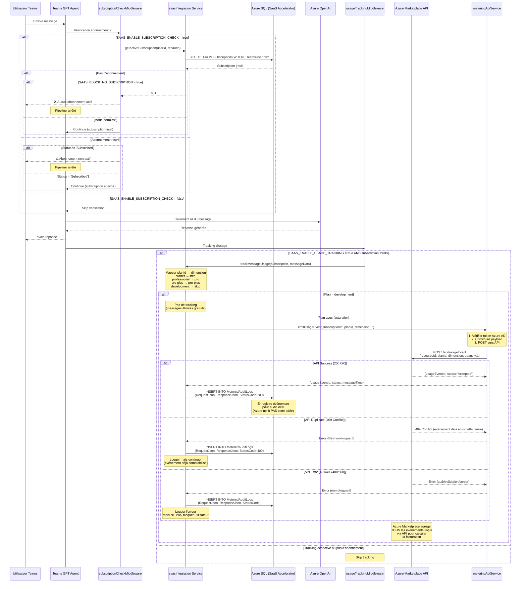

# Architecture Phase 2 : Intégration SaaS

## Vue d'ensemble

Cette phase intègre l'agent Teams GPT avec le SaaS Accelerator d'Azure Marketplace pour gérer les abonnements et la facturation à l'usage.

## Modèle de facturation Azure Marketplace

### Principe
```
Facturation mensuelle = Prix de base + (Messages utilisés - Quota inclus) × Tarif dépassement
```

### Plans disponibles

| Plan | Prix base | Messages inclus | Tarif dépassement | Dimension |
|------|-----------|-----------------|-------------------|-----------|
| Development | $0 | Illimité | N/A | N/A (pas de tracking) |
| Starter | $0 | 50 | $0.02 | `free` |
| Professional | $9.99 | 300 | $0.015 | `pro` |
| Pro Plus | $49.99 | 1500 | $0.01 | `pro-plus` |

### Responsabilités

#### Application Teams GPT
✅ Vérifier l'existence d'un abonnement actif (optionnel)
✅ **ÉMETTRE** les événements d'usage vers l'API Azure Marketplace (POST)
✅ Enregistrer localement dans `MeteredAuditLogs` pour audit (APRÈS émission API)
❌ NE PAS vérifier les limites de quota
❌ NE JAMAIS bloquer les dépassements

#### Azure Marketplace
✅ Recevoir les événements d'usage via API REST
✅ Calculer automatiquement les dépassements
✅ Facturer : base + (usage - quota) × tarif
✅ Gérer les périodes d'essai (pas de base ni de dépassement)
✅ Gérer les abonnements (création, suspension, résiliation)

## Mécanisme du compteur de messages (Metered Billing)

### Principe de fonctionnement

Azure Marketplace utilise un modèle de **facturation à la consommation** (metered billing) où l'application **émet activement** les événements d'usage vers l'API Marketplace. Azure Marketplace **NE LIT PAS** la base de données de l'application.

```
┌─────────────────────────────────────────────────────────────────┐
│                     Flux de facturation                          │
└─────────────────────────────────────────────────────────────────┘

1. Utilisateur envoie un message
          ↓
2. Application traite le message (OpenAI)
          ↓
3. ⚡ Application POST vers Marketplace Metering Service API
   https://marketplaceapi.microsoft.com/api/usageEvent
   Body: {
     resourceId: "subscription-guid",
     planId: "professional",
     dimension: "pro",
     quantity: 1,
     effectiveStartTime: "2024-01-15T10:30:00Z"
   }
          ↓
4. ✅ Azure Marketplace répond avec usageEventId
   Response: {
     usageEventId: "event-guid",
     status: "Accepted",
     messageTime: "2024-01-15T10:30:01Z",
     resourceId: "subscription-guid",
     quantity: 1,
     dimension: "pro"
   }
          ↓
5. 📝 Application INSERT dans MeteredAuditLogs (audit local uniquement)
   - RequestJson: événement envoyé
   - ResponseJson: réponse de l'API (avec usageEventId)
          ↓
6. 🧮 Azure Marketplace agrège tous les événements
          ↓
7. 💰 Azure Marketplace calcule et facture en fin de mois
```

### Architecture de l'API Marketplace Metering Service

#### Endpoint
```
POST https://marketplaceapi.microsoft.com/api/usageEvent?api-version=2018-08-31
```

#### Authentication
- **Méthode :** Azure AD Client Credentials Flow (OAuth 2.0)
- **Token endpoint :** `https://login.microsoftonline.com/{tenantId}/oauth2/token`
- **Resource ID :** `20e940b3-4c77-4b0b-9a53-9e16a1b010a7` (Marketplace API)
- **Grant type :** `client_credentials`
- **Credentials :** Client ID + Client Secret (même app registration que SaaS Accelerator)

#### Request Format
```json
{
  "resourceId": "xxxxxxxx-xxxx-xxxx-xxxx-xxxxxxxxxxxx",  // GUID de l'abonnement Marketplace
  "planId": "professional",                              // Plan de l'abonnement
  "dimension": "pro",                                    // Dimension de facturation
  "quantity": 1,                                         // Quantité (1 message)
  "effectiveStartTime": "2024-01-15T10:30:00.000Z"      // Timestamp UTC (ISO 8601)
}
```

#### Response (Success 200)
```json
{
  "usageEventId": "yyyyyyyy-yyyy-yyyy-yyyy-yyyyyyyyyyyy",
  "status": "Accepted",
  "messageTime": "2024-01-15T10:30:01.234Z",
  "resourceId": "xxxxxxxx-xxxx-xxxx-xxxx-xxxxxxxxxxxx",
  "quantity": 1.0,
  "dimension": "pro",
  "effectiveStartTime": "2024-01-15T10:30:00.000Z",
  "planId": "professional"
}
```

#### Error Responses
| Code | Signification | Action |
|------|---------------|--------|
| 400 | Bad Request (données invalides) | Vérifier format des données (resourceId doit être un GUID valide, quantity > 0) |
| 401 | Unauthorized (token invalide/expiré) | Renouveler le token Azure AD |
| 403 | Forbidden (abonnement non autorisé) | Vérifier que l'abonnement existe et est actif |
| 409 | Conflict (événement en double) | Un événement pour cette heure existe déjà, ignorer |
| 500 | Internal Server Error | Réessayer avec backoff exponentiel |

#### Contraintes importantes

1. **Un événement par heure maximum**
   - Limite : 1 événement par (resourceId + dimension + heure UTC)
   - Exemple : Si un événement est émis à 10:30:00, tout autre événement pour la même subscription+dimension entre 10:00:00 et 10:59:59 sera rejeté avec 409 Conflict
   - **Solution :** Agréger les messages par heure avant émission

2. **Fenêtre temporelle : 24 heures**
   - `effectiveStartTime` doit être dans les dernières 24 heures
   - Les événements antérieurs à 24h sont rejetés avec 400 Bad Request

3. **Idempotence**
   - Les événements avec même (resourceId + dimension + effectiveStartTime) sont dédupliqués
   - Utiliser 409 Conflict comme signal "déjà traité" (pas une erreur)

### Implémentation dans Teams GPT

#### Service meteringApiService.js

```javascript
const MarketplaceMeteringService = require('./services/meteringApiService');
const meteringService = new MarketplaceMeteringService();

// À l'initialisation de l'app
await meteringService.initialize();

// Lors du tracking d'un message
try {
  const result = await meteringService.emitUsageEvent(
    subscription.ampSubscriptionId,  // resourceId (GUID)
    subscription.ampPlanId,           // planId (ex: "professional")
    dimension,                         // "free", "pro", ou "pro-plus"
    1                                  // quantity = 1 message
  );
  
  console.log(`✅ Usage event emitted: ${result.usageEventId}`);
  
  // Enregistrer dans MeteredAuditLogs pour audit
  await db.insertMeteredAuditLog({
    SubscriptionId: subscription.id,
    RequestJson: JSON.stringify({
      resourceId: subscription.ampSubscriptionId,
      planId: subscription.ampPlanId,
      dimension,
      quantity: 1
    }),
    ResponseJson: JSON.stringify(result),
    StatusCode: 200
  });
  
} catch (error) {
  if (error.response?.status === 409) {
    // Événement en double (déjà émis cette heure), ignorer
    console.log('ℹ️ Usage event already emitted for this hour');
  } else {
    // Autre erreur : logger mais NE PAS bloquer l'utilisateur
    console.error('❌ Failed to emit usage event:', error);
  }
}
```

#### Gestion du cache de token Azure AD

Le service `meteringApiService` gère automatiquement :
- **Acquisition du token** : POST vers token endpoint avec client_id + client_secret
- **Cache du token** : Stocké en mémoire avec expiration (3600s - 300s buffer = 3300s)
- **Renouvellement automatique** : Vérifie expiration avant chaque appel API

```javascript
async getAccessToken() {
  // Vérifier si token en cache et valide
  if (this.accessToken && Date.now() < this.tokenExpiry) {
    return `Bearer ${this.accessToken}`;
  }
  
  // Acquérir nouveau token
  const response = await axios.post(tokenEndpoint, {
    grant_type: 'client_credentials',
    client_id: config.marketplace.clientId,
    client_secret: config.marketplace.clientSecret,
    resource: '20e940b3-4c77-4b0b-9a53-9e16a1b010a7'
  });
  
  // Cacher avec buffer de 5 minutes
  this.accessToken = response.data.access_token;
  this.tokenExpiry = Date.now() + (response.data.expires_in - 300) * 1000;
  
  return `Bearer ${this.accessToken}`;
}
```

#### Agrégation par heure (future amélioration)

**Problème actuel :** L'API limite à 1 événement/heure. Si un utilisateur envoie 10 messages en 30 minutes, seul le premier sera accepté.

**Solution :** Implémenter un système d'agrégation :
```javascript
// Buffer local (en mémoire ou Redis)
const usageBuffer = new Map();

async function trackMessage(subscriptionId, dimension) {
  const hour = new Date().setMinutes(0, 0, 0); // Arrondir à l'heure
  const key = `${subscriptionId}:${dimension}:${hour}`;
  
  // Incrémenter compteur local
  const count = (usageBuffer.get(key) || 0) + 1;
  usageBuffer.set(key, count);
  
  // Émettre vers API toutes les heures
  if (count === 1 || isNewHour()) {
    await meteringService.emitUsageEvent(subscriptionId, planId, dimension, count);
    usageBuffer.delete(key);
  }
}
```

**Note :** Pour Phase 2.5, on émet 1 événement par message (acceptable pour MVP). L'agrégation sera implémentée en Phase 3 si nécessaire.

### Table MeteredAuditLogs : Audit local uniquement

**IMPORTANT :** Cette table est utilisée **EXCLUSIVEMENT pour l'audit local**. Azure Marketplace **NE LIT JAMAIS** cette table.

#### Structure
```sql
CREATE TABLE MeteredAuditLogs (
    Id INT PRIMARY KEY IDENTITY,
    SubscriptionId UNIQUEIDENTIFIER NOT NULL,  -- ID interne SaaS Accelerator
    RequestJson NVARCHAR(MAX),                 -- Événement envoyé à l'API
    ResponseJson NVARCHAR(MAX),                -- Réponse de l'API (avec usageEventId)
    StatusCode INT,                            -- Code HTTP (200, 409, 400, 500)
    RunBy NVARCHAR(256),                       -- "system" ou userId
    CreatedDate DATETIME2 NOT NULL DEFAULT GETUTCDATE()
);
```

#### Exemple de données
```json
// RequestJson
{
  "resourceId": "12345678-1234-1234-1234-123456789abc",
  "planId": "professional",
  "dimension": "pro",
  "quantity": 1,
  "effectiveStartTime": "2024-01-15T10:30:00.000Z"
}

// ResponseJson (StatusCode 200)
{
  "usageEventId": "87654321-4321-4321-4321-cba987654321",
  "status": "Accepted",
  "messageTime": "2024-01-15T10:30:01.234Z",
  "resourceId": "12345678-1234-1234-1234-123456789abc",
  "quantity": 1.0,
  "dimension": "pro",
  "effectiveStartTime": "2024-01-15T10:30:00.000Z",
  "planId": "professional"
}

// ResponseJson (StatusCode 409 - Duplicate)
{
  "error": {
    "code": "Conflict",
    "message": "Duplicate usage event for the same hour"
  }
}
```

#### Utilité de MeteredAuditLogs

1. **Audit et conformité**
   - Traçabilité complète des événements émis
   - Preuve en cas de litige avec Azure
   - Conformité RGPD (logs horodatés)

2. **Debugging**
   - Vérifier quels événements ont été émis
   - Identifier les erreurs 409 (duplicates)
   - Analyser les échecs d'émission (400, 401, 500)

3. **Reporting interne**
   - Comparer usage réel vs facturation Azure
   - Statistiques par dimension
   - Dashboard d'administration

4. **Réconciliation**
   - Vérifier cohérence avec Azure Marketplace
   - Détecter événements manquants ou rejetés
   - Support client (prouver que l'événement a été émis)

**Azure Marketplace calcule la facturation en se basant UNIQUEMENT sur les événements reçus via l'API, PAS sur cette table.**


## Architecture des composants

### Vue macro

```
┌─────────────────────────────────────────────────────────────────┐
│                         Microsoft Teams                          │
│                    (Interface utilisateur)                       │
└────────────────────────┬────────────────────────────────────────┘
                         │ Messages utilisateur
                         ▼
┌─────────────────────────────────────────────────────────────────┐
│                      Teams GPT Agent                             │
│                      (src/app/app.js)                           │
│                                                                   │
│  ┌─────────────────────────────────────────────────────────┐   │
│  │              Middleware Pipeline                         │   │
│  │                                                          │   │
│  │  1. subscriptionCheckMiddleware                         │   │
│  │     └─> Vérifie abonnement actif (optionnel)           │   │
│  │                                                          │   │
│  │  2. messageHandler                                       │   │
│  │     └─> Traitement OpenAI                               │   │
│  │                                                          │   │
│  │  3. usageTrackingMiddleware (APRÈS traitement)          │   │
│  │     └─> Émet événement vers Marketplace API            │   │
│  │     └─> Enregistre dans MeteredAuditLogs (audit)       │   │
│  └─────────────────────────────────────────────────────────┘   │
└────────┬──────────────────────┬────────────┬────────────────────┘
         │                      │            │
         ▼                      ▼            ▼
┌─────────────────┐  ┌─────────────────────────────────────────┐
│  Azure OpenAI   │  │  SaaS Integration Service               │
│  Service        │  │  (src/services/saasIntegration.js)      │
│  (Traitement)   │  │                                         │
└─────────────────┘  │  ┌───────────────────────────────────┐ │
                     │  │  meteringApiService.js            │ │
                     │  │  - Azure AD authentication        │ │
                     │  │  - POST to Marketplace API        │ │
                     │  │  - Token caching & retry logic    │ │
                     │  └──────────────┬────────────────────┘ │
                     └─────────────────┼──────────────────────┘
                                       │            │
                          ┌────────────┘            └────────────┐
                          ▼                                      ▼
           ┌──────────────────────────────┐   ┌─────────────────────────────┐
           │  Azure SQL Database          │   │  Azure Marketplace          │
           │  (SaaS Accelerator)          │   │  Metering Service API       │
           │                              │   │                             │
           │  - Subscriptions             │   │  POST /api/usageEvent       │
           │  - MeteredAuditLogs (audit)  │   │  {resourceId, dimension,    │
           └──────────────────────────────┘   │   quantity, planId}         │
                                              │                             │
                                              │  → Calcule facturation      │
                                              └─────────────────────────────┘
```

## Flux de traitement d'un message

### Diagramme de séquence



## Composants détaillés

### 1. subscriptionCheckMiddleware
**Fichier :** `src/middleware/subscriptionCheck.js`

**Responsabilités :**
- Vérifier si un abonnement actif existe (optionnel via feature flag)
- Bloquer l'accès si pas d'abonnement (optionnel via feature flag)
- Attacher l'objet `subscription` au contexte pour les middlewares suivants

**Configuration :**
```javascript
SAAS_ENABLE_SUBSCRIPTION_CHECK=true/false  // Activer la vérification
SAAS_BLOCK_NO_SUBSCRIPTION=true/false      // Bloquer si pas d'abonnement
SAAS_PERMISSIVE_MODE=true/false            // Continuer en cas d'erreur DB
```

**Logique :**
```
SI SAAS_ENABLE_SUBSCRIPTION_CHECK = false
  → Skip, continuer vers messageHandler

SINON
  getActiveSubscription(userId, tenantId)
  
  SI pas d'abonnement
    SI SAAS_BLOCK_NO_SUBSCRIPTION = true
      → Afficher message "Aucun abonnement actif"
      → STOP pipeline
    SINON
      → Continuer (context.subscription = null)
  
  SI abonnement.status != 'Subscribed'
    SI SAAS_PERMISSIVE_MODE = true
      → Continuer quand même
    SINON
      → Afficher message "Abonnement non actif"
      → STOP pipeline
  
  SINON
    → Attacher subscription au contexte
    → Continuer vers messageHandler
```

### 2. messageHandler
**Fichier :** `src/app/app.js` (fonction inline)

**Responsabilités :**
- Récupérer l'historique de conversation
- Créer le prompt avec instructions
- Appeler Azure OpenAI
- Streamer ou envoyer la réponse
- Gérer les erreurs

**Remarque :** Ce handler ne change PAS pour la Phase 2, il est déjà fonctionnel.

### 3. usageTrackingMiddleware
**Fichier :** `src/middleware/usageTracking.js`

**Responsabilités :**
- Enregistrer l'usage dans `MeteredAuditLogs` APRÈS traitement réussi
- Mapper le plan vers la dimension appropriée
- Respecter le feature flag `SAAS_ENABLE_USAGE_TRACKING`
- Ne JAMAIS bloquer l'utilisateur (même en cas d'erreur de tracking)

**Configuration :**
```javascript
SAAS_ENABLE_USAGE_TRACKING=true/false  // Activer l'enregistrement d'usage
```

**Logique :**
```
SI SAAS_ENABLE_USAGE_TRACKING = false
  → Skip, retour immédiat

SI pas de subscription (context.subscription = null)
  → Skip, retour immédiat

messageHandler s'exécute (traitement OpenAI)

APRÈS traitement réussi:
  Mapper subscription.planId → dimension
    - development → skip (pas de tracking)
    - starter → 'free'
    - professional → 'pro'  
    - pro-plus → 'pro-plus'
  
  SI dimension existe
    trackMessageUsage(subscription, {
      dimension: dimension,
      quantity: 1,
      userId: hashedUserId,
      conversationId: conversationId,
      timestamp: now
    })
  
  EN CAS D'ERREUR:
    → Logger erreur
    → NE PAS bloquer l'utilisateur
    → Réponse déjà envoyée
```

**❌ CE QU'IL NE FAUT PAS FAIRE :**
- ❌ Vérifier les limites de quota (`checkMessageLimit`)
- ❌ Bloquer si quota dépassé
- ❌ Afficher des warnings de limite
- ❌ Empêcher le traitement du message

**✅ CE QU'IL FAUT FAIRE :**
- ✅ Enregistrer TOUS les messages dans `MeteredAuditLogs`
- ✅ Laisser Azure Marketplace gérer la facturation
- ✅ Continuer même en cas d'erreur de tracking

### 4. saasIntegration Service
**Fichier :** `src/services/saasIntegration.js`

**Responsabilités :**
- Gérer la connexion à Azure SQL (Managed Identity)
- Requêter la table `Subscriptions`
- Insérer dans la table `MeteredAuditLogs`
- Gérer les erreurs de connexion

**Méthodes principales :**

#### `getActiveSubscription(teamsUserId, tenantId)`
```sql
SELECT TOP 1 
  s.Id,
  s.AMPSubscriptionId,
  s.AMPPlanId as planId,
  s.AMPQuantity,
  s.SubscriptionStatus as saasSubscriptionStatus,
  s.IsActive,
  s.TeamsUserId,
  s.TenantId
FROM Subscriptions s
WHERE s.TeamsUserId = @teamsUserId
  AND (@tenantId IS NULL OR s.TenantId = @tenantId)
  AND s.IsActive = 1
  AND s.SubscriptionStatus = 'Subscribed'
ORDER BY s.CreatedDate DESC
```

Retourne :
```javascript
{
  id: 123,
  ampSubscriptionId: 'FC4A0055-D1D7-464B-C64E-8E862AD4C1B1',
  planId: 'starter',
  ampQuantity: 1,
  saasSubscriptionStatus: 'Subscribed',
  isActive: true,
  teamsUserId: 'aad-guid',
  tenantId: 'tenant-guid'
}
```

#### `trackMessageUsage(subscription, messageData)`
```sql
INSERT INTO MeteredAuditLogs (
  SubscriptionId,
  RequestJson,
  ResponseJson,
  StatusCode,
  CreatedDate
)
VALUES (
  @subscriptionId,
  @requestJson,  -- JSON: {dimension, quantity, effectiveStartTime, resourceId}
  NULL,
  200,
  GETUTCDATE()
)
```

Le JSON stocké (RequestJson) :
```javascript
{
  "resourceId": "subscription-marketplace-guid",
  "planId": "professional",
  "dimension": "pro",
  "quantity": 1,
  "effectiveStartTime": "2025-10-31T10:30:00Z"
}
```

Le JSON de réponse (ResponseJson) :
```javascript
{
  "usageEventId": "event-guid-returned-by-marketplace",
  "status": "Accepted",
  "messageTime": "2025-10-31T10:30:01Z",
  "resourceId": "subscription-marketplace-guid",
  "quantity": 1.0,
  "dimension": "pro",
  "effectiveStartTime": "2025-10-31T10:30:00Z",
  "planId": "professional"
}
```

### 5. meteringApiService

**Fichier :** `src/services/meteringApiService.js`

**Responsabilités :**
- Authentifier avec Azure AD (client credentials flow)
- Gérer le cache de token d'accès (3600s - 300s buffer)
- Émettre les événements d'usage vers l'API Azure Marketplace
- Gérer les erreurs et les retries
- Valider les données avant envoi

**Configuration :**
```javascript
MARKETPLACE_CLIENT_ID         // Client ID (app registration)
MARKETPLACE_CLIENT_SECRET     // Client Secret
MARKETPLACE_TENANT_ID         // Tenant ID
MARKETPLACE_ENABLE_EMISSION   // true/false (feature flag)
```

**Méthodes principales :**

#### `initialize()`
Valide la configuration et initialise le service.

#### `getAccessToken()`
```javascript
// Acquiert et cache le token Azure AD
const token = await getAccessToken();
// → "Bearer eyJ0eXAiOiJKV1QiLCJhbGc..."

// Cache automatique avec expiration
// Renouvelle uniquement si expiré
```

#### `emitUsageEvent(subscriptionId, planId, dimension, quantity, effectiveStartTime)`
```javascript
// Émet un événement d'usage vers l'API Marketplace
const result = await meteringService.emitUsageEvent(
  "12345678-1234-1234-1234-123456789abc",  // subscriptionId (GUID Marketplace)
  "professional",                           // planId
  "pro",                                    // dimension
  1,                                        // quantity
  "2024-01-15T10:30:00.000Z"               // effectiveStartTime (optionnel, défaut: now)
);

// Response:
{
  usageEventId: "87654321-4321-4321-4321-cba987654321",
  status: "Accepted",
  messageTime: "2024-01-15T10:30:01.234Z",
  resourceId: "12345678-1234-1234-1234-123456789abc",
  quantity: 1.0,
  dimension: "pro",
  effectiveStartTime: "2024-01-15T10:30:00.000Z",
  planId: "professional"
}
```

**Gestion des erreurs :**
- **401 Unauthorized** : Token expiré ou invalide → Renouveler automatiquement
- **409 Conflict** : Événement déjà émis cette heure → Logger mais continuer (non-bloquant)
- **400 Bad Request** : Données invalides → Logger et alerter (erreur de code)
- **500 Internal Server Error** : Erreur Azure → Retry avec backoff exponentiel (3 tentatives)

**Retry Logic :**
```javascript
// Retry automatique (3 tentatives, 1000ms delay)
try {
  return await axios.post(url, data, config);
} catch (error) {
  if (attempt < maxRetries && isRetryableError(error)) {
    await sleep(retryDelayMs);
    return await makeRequest(attempt + 1);
  }
  throw error;
}
```

**Token Caching :**
```javascript
// Cache en mémoire avec vérification d'expiration
if (this.accessToken && Date.now() < this.tokenExpiry) {
  return this.accessToken;  // Réutiliser token existant
}

// Sinon, acquérir nouveau token
const tokenData = await getTokenFromAzureAD();
this.accessToken = tokenData.access_token;
this.tokenExpiry = Date.now() + (tokenData.expires_in - 300) * 1000;  // Buffer 5min
```

## Schéma de base de données

### Table `Subscriptions`
```sql
Subscriptions
├── Id (int, PK)
├── AMPSubscriptionId (uniqueidentifier) -- ID Azure Marketplace (resourceId pour API)
├── AMPPlanId (varchar) -- Plan ID: starter, professional, pro-plus, development
├── AMPQuantity (int) -- Quantité (toujours 1 pour nos plans)
├── SubscriptionStatus (varchar) -- Subscribed, Suspended, Unsubscribed, PendingActivation
├── IsActive (bit)
├── TeamsUserId (nvarchar) -- Azure AD Object ID de l'utilisateur Teams
├── TeamsConversationId (nvarchar) -- ID de conversation Teams
├── TenantId (nvarchar) -- Tenant Azure AD
├── CreatedDate (datetime)
└── ModifiedDate (datetime)
```

### Table `MeteredAuditLogs`
```sql
MeteredAuditLogs
├── Id (int, PK)
├── SubscriptionId (int, FK → Subscriptions.Id)
├── RequestJson (nvarchar) -- JSON envoyé à l'API Marketplace (événement d'usage)
├── ResponseJson (nvarchar) -- Réponse de l'API Marketplace (avec usageEventId)
├── StatusCode (int) -- HTTP status (200 OK, 409 Conflict, 401 Unauthorized, etc.)
├── CreatedDate (datetime)
└── RunBy (nvarchar) -- Service qui a créé l'entrée
```

**Note IMPORTANTE :** Azure Marketplace **NE LIT JAMAIS** cette table. Elle est utilisée **UNIQUEMENT pour l'audit local**. La facturation Azure est basée sur les événements reçus via l'API POST /api/usageEvent.

## Feature Flags

### Configuration complète

| Variable | Valeurs | Par défaut | Description |
|----------|---------|------------|-------------|
| `SAAS_ENABLE_SUBSCRIPTION_CHECK` | true/false | false (dev) | Active la vérification d'abonnement |
| `SAAS_ENABLE_USAGE_TRACKING` | true/false | false (dev) | Active l'enregistrement dans MeteredAuditLogs |
| `SAAS_BLOCK_NO_SUBSCRIPTION` | true/false | false (dev) | Bloque si pas d'abonnement |
| `SAAS_PERMISSIVE_MODE` | true/false | true (dev) | Continue en cas d'erreur DB |
| `SAAS_DEBUG_MODE` | true/false | false | Logs détaillés |

### Environnements recommandés

#### Développement (.env.dev)
```env
SAAS_ENABLE_SUBSCRIPTION_CHECK=false  # Pas de vérification en dev
SAAS_ENABLE_USAGE_TRACKING=false      # Pas de tracking en dev
SAAS_BLOCK_NO_SUBSCRIPTION=false      # Ne pas bloquer
SAAS_PERMISSIVE_MODE=true             # Tolérant aux erreurs
SAAS_DEBUG_MODE=true                  # Logs détaillés
```

#### Local (.env.local)
```env
SAAS_ENABLE_SUBSCRIPTION_CHECK=true   # Tester la vérification
SAAS_ENABLE_USAGE_TRACKING=true       # Tester le tracking
SAAS_BLOCK_NO_SUBSCRIPTION=false      # Ne pas bloquer (pour tester)
SAAS_PERMISSIVE_MODE=true             # Tolérant aux erreurs
SAAS_DEBUG_MODE=true                  # Logs détaillés
```

#### Production (.env)
```env
SAAS_ENABLE_SUBSCRIPTION_CHECK=true   # Vérification activée
SAAS_ENABLE_USAGE_TRACKING=true       # Tracking activé
SAAS_BLOCK_NO_SUBSCRIPTION=true       # Bloquer si pas d'abonnement
SAAS_PERMISSIVE_MODE=false            # Mode strict
SAAS_DEBUG_MODE=false                 # Pas de logs détaillés
```

## Scénarios d'utilisation

### Scénario 1 : Utilisateur avec abonnement Starter actif
1. Utilisateur envoie un message dans Teams
2. `subscriptionCheckMiddleware` vérifie l'abonnement → ✅ Trouvé (plan: starter, status: Subscribed)
3. `messageHandler` traite le message avec OpenAI → ✅ Réponse générée
4. Réponse envoyée à l'utilisateur
5. `usageTrackingMiddleware` enregistre :
   - Dimension: `free`
   - Quantity: `1`
   - Dans `MeteredAuditLogs`
6. Azure Marketplace calcule : $0 (base) + max(0, messages_utilisés - 50) × $0.02

### Scénario 2 : Utilisateur sans abonnement (mode strict)
1. Utilisateur envoie un message
2. `subscriptionCheckMiddleware` vérifie → ❌ Pas d'abonnement
3. Feature flag `SAAS_BLOCK_NO_SUBSCRIPTION=true` → Bloquer
4. Message affiché : "❌ Aucun abonnement actif trouvé"
5. Pipeline arrêté, message non traité

### Scénario 3 : Utilisateur sans abonnement (mode permissif)
1. Utilisateur envoie un message
2. `subscriptionCheckMiddleware` vérifie → ❌ Pas d'abonnement
3. Feature flag `SAAS_BLOCK_NO_SUBSCRIPTION=false` → Continuer
4. `messageHandler` traite le message → ✅ Réponse générée
5. Réponse envoyée
6. `usageTrackingMiddleware` → Skip (pas de subscription)
7. Pas de facturation

### Scénario 4 : Erreur de connexion DB (mode permissif)
1. Utilisateur envoie un message
2. `subscriptionCheckMiddleware` tente de vérifier → ❌ Erreur SQL
3. Feature flag `SAAS_PERMISSIVE_MODE=true` → Continuer
4. `messageHandler` traite le message → ✅ Réponse générée
5. Réponse envoyée
6. `usageTrackingMiddleware` tente de tracker → ❌ Erreur SQL
7. Erreur loggée, utilisateur non bloqué

### Scénario 5 : Plan Development (messages illimités)
1. Utilisateur avec plan `development` envoie un message
2. `subscriptionCheckMiddleware` vérifie → ✅ Trouvé (plan: development)
3. `messageHandler` traite le message → ✅ Réponse générée
4. Réponse envoyée
5. `usageTrackingMiddleware` :
   - Détecte plan=development
   - Skip tracking (pas de dimension associée)
6. Pas de facturation (plan gratuit illimité)

### Scénario 6 : Utilisateur dépasse son quota (100 messages sur plan Starter)
1. Utilisateur envoie son 100ème message du mois
2. `subscriptionCheckMiddleware` vérifie → ✅ Abonnement actif
3. ❌ PAS de vérification de quota (supprimé - Azure gère le comptage)
4. `messageHandler` traite le message → ✅ Réponse générée
5. Réponse envoyée normalement
6. `usageTrackingMiddleware` enregistre message #100 :
   - Appelle `meteringApiService.emitUsageEvent()`
   - POST vers `https://marketplaceapi.microsoft.com/api/usageEvent`
   - Body: `{resourceId: guid, planId: "starter", dimension: "free", quantity: 1}`
   - Azure Marketplace répond 200 OK avec `usageEventId`
   - INSERT dans `MeteredAuditLogs` (audit local avec RequestJson + ResponseJson)
7. Azure Marketplace calcule automatiquement : $0 + (100 - 50) × $0.02 = **$1.00**
8. Utilisateur reçoit sa facture en fin de mois : $1.00
9. ✅ Pas de blocage, service continu, facturation automatique par Azure

## Points clés d'architecture

### ✅ Principes à respecter

1. **Séparation des responsabilités**
   - Middlewares : Vérification et tracking uniquement
   - SaaS Accelerator DB : Stockage des abonnements et logs d'usage
   - Azure Marketplace : Facturation automatique

2. **Résilience**
   - Mode permissif pour tolérer les erreurs DB
   - Feature flags pour activer/désactiver les fonctionnalités
   - Ne jamais bloquer après avoir envoyé la réponse

3. **Sécurité**
   - Managed Identity pour Azure SQL (pas de mot de passe)
   - Hash des userId dans les logs (RGPD)
   - Validation des données d'entrée

4. **Traçabilité**
   - Tous les messages enregistrés dans `MeteredAuditLogs`
   - Logs console pour debug
   - StatusCode dans les logs d'audit

### ❌ Anti-patterns à éviter

1. ❌ **Ne jamais** vérifier les quotas dans l'application
2. ❌ **Ne jamais** bloquer les dépassements de quota
3. ❌ **Ne jamais** calculer la facturation dans l'application
4. ❌ **Ne jamais** gérer les périodes d'essai manuellement
5. ❌ **Ne jamais** bloquer après avoir traité le message

## Tests d'intégration requis

### Tests fonctionnels
- [ ] Utilisateur avec abonnement actif (chaque plan)
- [ ] Utilisateur sans abonnement (mode strict)
- [ ] Utilisateur sans abonnement (mode permissif)
- [ ] Abonnement suspendu
- [ ] Abonnement en attente d'activation
- [ ] Plan Development (pas de tracking)

### Tests de résilience
- [ ] DB indisponible (mode permissif)
- [ ] DB indisponible (mode strict)
- [ ] Erreur lors du tracking (après traitement)
- [ ] Timeout SQL

### Tests de configuration
- [ ] Feature flags désactivés (tous)
- [ ] `SAAS_ENABLE_SUBSCRIPTION_CHECK=false`
- [ ] `SAAS_ENABLE_USAGE_TRACKING=false`
- [ ] `SAAS_BLOCK_NO_SUBSCRIPTION=false`

### Tests de facturation
- [ ] Entrées `MeteredAuditLogs` correctes (dimension + quantity=1)
- [ ] Pas de tracking pour plan Development
- [ ] Mapping plan→dimension correct

## Prochaines étapes

1. ✅ Modifier `subscriptionCheck.js` pour respecter les feature flags
2. 🔄 Simplifier `usageTrackingMiddleware` :
   - Supprimer `checkMessageLimit`
   - Supprimer warnings de quota
   - Garder uniquement `trackMessageUsage`
3. ⏳ Créer/simplifier services manquants (messageClassifier)
4. ⏳ Implémenter mapping plan→dimension
5. ⏳ Tests d'intégration complets
6. ⏳ Documentation finale
7. ⏳ Tag v1.2.5

## Questions ouvertes

- [ ] Faut-il envoyer un email de notification quand l'utilisateur dépasse son quota ?
- [ ] Doit-on afficher l'usage actuel dans un message de bienvenue ?
- [ ] Comment gérer le passage d'un plan à un autre (upgrade/downgrade) ?
- [ ] Doit-on logger l'usage dans une table séparée pour analytics ?

---

**Document créé le :** 31 octobre 2025  
**Version :** 1.0  
**Statut :** Draft pour validation
