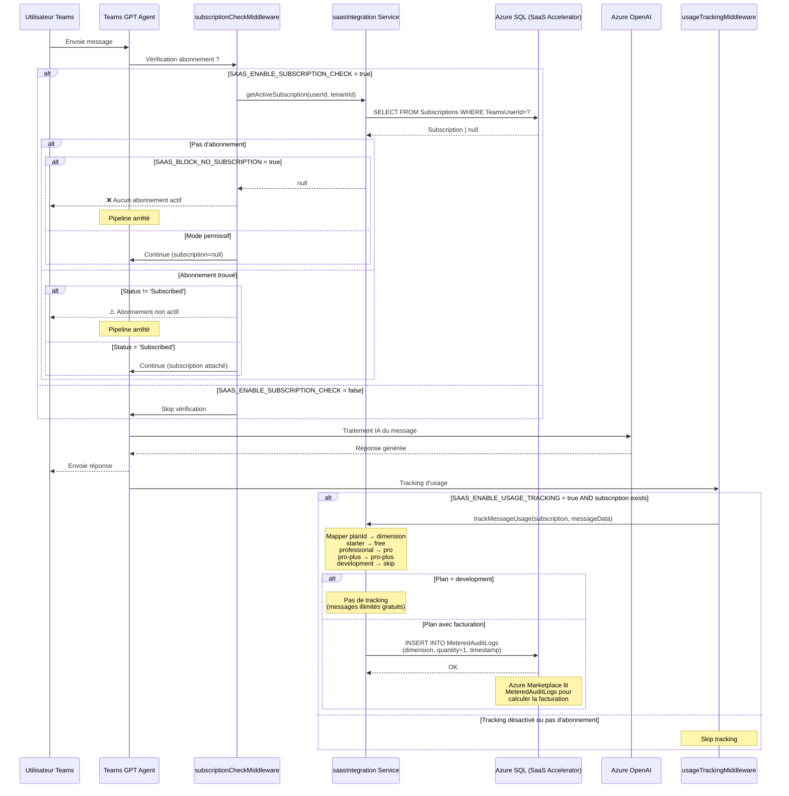

# Architecture Phase 2 : Intégration SaaS

## Vue d'ensemble

Cette phase intègre l'agent Teams GPT avec le SaaS Accelerator d'Azure Marketplace pour gérer les abonnements et la facturation à l'usage.

## Modèle de facturation Azure Marketplace

### Principe
```
Facturation mensuelle = Prix de base + (Messages utilisés - Quota inclus) × Tarif dépassement
```

### Plans disponibles

| Plan | Prix base | Messages inclus | Tarif dépassement | Dimension |
|------|-----------|-----------------|-------------------|-----------|
| Development | $0 | Illimité | N/A | N/A (pas de tracking) |
| Starter | $0 | 50 | $0.02 | `free` |
| Professional | $9.99 | 300 | $0.015 | `pro` |
| Pro Plus | $49.99 | 1500 | $0.01 | `pro-plus` |

### Responsabilités

#### Application Teams GPT
✅ Vérifier l'existence d'un abonnement actif (optionnel)
✅ Enregistrer TOUS les messages dans `MeteredAuditLogs` (dimension + quantity)
❌ NE PAS vérifier les limites de quota
❌ NE JAMAIS bloquer les dépassements

#### Azure Marketplace
✅ Calculer automatiquement les dépassements
✅ Facturer : base + (usage - quota) × tarif
✅ Gérer les périodes d'essai (pas de base ni de dépassement)
✅ Gérer les abonnements (création, suspension, résiliation)

## Architecture des composants

### Vue macro

```
┌─────────────────────────────────────────────────────────────────┐
│                         Microsoft Teams                          │
│                    (Interface utilisateur)                       │
└────────────────────────┬────────────────────────────────────────┘
                         │ Messages utilisateur
                         ▼
┌─────────────────────────────────────────────────────────────────┐
│                      Teams GPT Agent                             │
│                      (src/app/app.js)                           │
│                                                                   │
│  ┌─────────────────────────────────────────────────────────┐   │
│  │              Middleware Pipeline                         │   │
│  │                                                          │   │
│  │  1. subscriptionCheckMiddleware                         │   │
│  │     └─> Vérifie abonnement actif (optionnel)           │   │
│  │                                                          │   │
│  │  2. messageHandler                                       │   │
│  │     └─> Traitement OpenAI                               │   │
│  │                                                          │   │
│  │  3. usageTrackingMiddleware (APRÈS traitement)          │   │
│  │     └─> Enregistre usage dans MeteredAuditLogs         │   │
│  └─────────────────────────────────────────────────────────┘   │
└────────────────────┬────────────────────┬───────────────────────┘
                     │                    │
                     ▼                    ▼
┌─────────────────────────────┐  ┌──────────────────────────────┐
│  Azure OpenAI Service       │  │  SaaS Integration Service    │
│  (Traitement IA)            │  │  (src/services/              │
│                             │  │   saasIntegration.js)        │
└─────────────────────────────┘  └──────────────┬───────────────┘
                                                 │
                                                 ▼
                                  ┌──────────────────────────────┐
                                  │  Azure SQL Database          │
                                  │  (SaaS Accelerator)          │
                                  │                              │
                                  │  - Subscriptions             │
                                  │  - MeteredAuditLogs          │
                                  └──────────────┬───────────────┘
                                                 │
                                                 ▼
                                  ┌──────────────────────────────┐
                                  │  Azure Marketplace           │
                                  │  (Facturation automatique)   │
                                  └──────────────────────────────┘
```

## Flux de traitement d'un message

### Diagramme de séquence



## Composants détaillés

### 1. subscriptionCheckMiddleware
**Fichier :** `src/middleware/subscriptionCheck.js`

**Responsabilités :**
- Vérifier si un abonnement actif existe (optionnel via feature flag)
- Bloquer l'accès si pas d'abonnement (optionnel via feature flag)
- Attacher l'objet `subscription` au contexte pour les middlewares suivants

**Configuration :**
```javascript
SAAS_ENABLE_SUBSCRIPTION_CHECK=true/false  // Activer la vérification
SAAS_BLOCK_NO_SUBSCRIPTION=true/false      // Bloquer si pas d'abonnement
SAAS_PERMISSIVE_MODE=true/false            // Continuer en cas d'erreur DB
```

**Logique :**
```
SI SAAS_ENABLE_SUBSCRIPTION_CHECK = false
  → Skip, continuer vers messageHandler

SINON
  getActiveSubscription(userId, tenantId)
  
  SI pas d'abonnement
    SI SAAS_BLOCK_NO_SUBSCRIPTION = true
      → Afficher message "Aucun abonnement actif"
      → STOP pipeline
    SINON
      → Continuer (context.subscription = null)
  
  SI abonnement.status != 'Subscribed'
    SI SAAS_PERMISSIVE_MODE = true
      → Continuer quand même
    SINON
      → Afficher message "Abonnement non actif"
      → STOP pipeline
  
  SINON
    → Attacher subscription au contexte
    → Continuer vers messageHandler
```

### 2. messageHandler
**Fichier :** `src/app/app.js` (fonction inline)

**Responsabilités :**
- Récupérer l'historique de conversation
- Créer le prompt avec instructions
- Appeler Azure OpenAI
- Streamer ou envoyer la réponse
- Gérer les erreurs

**Remarque :** Ce handler ne change PAS pour la Phase 2, il est déjà fonctionnel.

### 3. usageTrackingMiddleware
**Fichier :** `src/middleware/usageTracking.js`

**Responsabilités :**
- Enregistrer l'usage dans `MeteredAuditLogs` APRÈS traitement réussi
- Mapper le plan vers la dimension appropriée
- Respecter le feature flag `SAAS_ENABLE_USAGE_TRACKING`
- Ne JAMAIS bloquer l'utilisateur (même en cas d'erreur de tracking)

**Configuration :**
```javascript
SAAS_ENABLE_USAGE_TRACKING=true/false  // Activer l'enregistrement d'usage
```

**Logique :**
```
SI SAAS_ENABLE_USAGE_TRACKING = false
  → Skip, retour immédiat

SI pas de subscription (context.subscription = null)
  → Skip, retour immédiat

messageHandler s'exécute (traitement OpenAI)

APRÈS traitement réussi:
  Mapper subscription.planId → dimension
    - development → skip (pas de tracking)
    - starter → 'free'
    - professional → 'pro'  
    - pro-plus → 'pro-plus'
  
  SI dimension existe
    trackMessageUsage(subscription, {
      dimension: dimension,
      quantity: 1,
      userId: hashedUserId,
      conversationId: conversationId,
      timestamp: now
    })
  
  EN CAS D'ERREUR:
    → Logger erreur
    → NE PAS bloquer l'utilisateur
    → Réponse déjà envoyée
```

**❌ CE QU'IL NE FAUT PAS FAIRE :**
- ❌ Vérifier les limites de quota (`checkMessageLimit`)
- ❌ Bloquer si quota dépassé
- ❌ Afficher des warnings de limite
- ❌ Empêcher le traitement du message

**✅ CE QU'IL FAUT FAIRE :**
- ✅ Enregistrer TOUS les messages dans `MeteredAuditLogs`
- ✅ Laisser Azure Marketplace gérer la facturation
- ✅ Continuer même en cas d'erreur de tracking

### 4. saasIntegration Service
**Fichier :** `src/services/saasIntegration.js`

**Responsabilités :**
- Gérer la connexion à Azure SQL (Managed Identity)
- Requêter la table `Subscriptions`
- Insérer dans la table `MeteredAuditLogs`
- Gérer les erreurs de connexion

**Méthodes principales :**

#### `getActiveSubscription(teamsUserId, tenantId)`
```sql
SELECT TOP 1 
  s.Id,
  s.AMPSubscriptionId,
  s.AMPPlanId as planId,
  s.AMPQuantity,
  s.SubscriptionStatus as saasSubscriptionStatus,
  s.IsActive,
  s.TeamsUserId,
  s.TenantId
FROM Subscriptions s
WHERE s.TeamsUserId = @teamsUserId
  AND (@tenantId IS NULL OR s.TenantId = @tenantId)
  AND s.IsActive = 1
  AND s.SubscriptionStatus = 'Subscribed'
ORDER BY s.CreatedDate DESC
```

Retourne :
```javascript
{
  id: 123,
  ampSubscriptionId: 'FC4A0055-D1D7-464B-C64E-8E862AD4C1B1',
  planId: 'starter',
  ampQuantity: 1,
  saasSubscriptionStatus: 'Subscribed',
  isActive: true,
  teamsUserId: 'aad-guid',
  tenantId: 'tenant-guid'
}
```

#### `trackMessageUsage(subscription, messageData)`
```sql
INSERT INTO MeteredAuditLogs (
  SubscriptionId,
  RequestJson,
  ResponseJson,
  StatusCode,
  CreatedDate
)
VALUES (
  @subscriptionId,
  @requestJson,  -- JSON: {dimension, quantity, effectiveStartTime, resourceId}
  NULL,
  200,
  GETUTCDATE()
)
```

Le JSON stocké :
```javascript
{
  "dimension": "free" | "pro" | "pro-plus",
  "quantity": 1,
  "effectiveStartTime": "2025-10-31T10:30:00Z",
  "resourceId": "hashed-user-id",
  "planId": "starter",
  "conversationId": "conversation-id",
  "timestamp": "2025-10-31T10:30:00Z"
}
```

## Schéma de base de données

### Table `Subscriptions`
```sql
Subscriptions
├── Id (int, PK)
├── AMPSubscriptionId (uniqueidentifier) -- ID Azure Marketplace
├── AMPPlanId (varchar) -- Plan ID: starter, professional, pro-plus, development
├── AMPQuantity (int) -- Quantité (toujours 1 pour nos plans)
├── SubscriptionStatus (varchar) -- Subscribed, Suspended, Unsubscribed, PendingActivation
├── IsActive (bit)
├── TeamsUserId (nvarchar) -- Azure AD Object ID de l'utilisateur Teams
├── TeamsConversationId (nvarchar) -- ID de conversation Teams
├── TenantId (nvarchar) -- Tenant Azure AD
├── CreatedDate (datetime)
└── ModifiedDate (datetime)
```

### Table `MeteredAuditLogs`
```sql
MeteredAuditLogs
├── Id (int, PK)
├── SubscriptionId (int, FK → Subscriptions.Id)
├── RequestJson (nvarchar) -- JSON avec dimension, quantity, effectiveStartTime
├── ResponseJson (nvarchar) -- Réponse API (optionnel)
├── StatusCode (int) -- HTTP status (200, 400, etc.)
├── CreatedDate (datetime)
└── RunBy (nvarchar) -- Service qui a créé l'entrée
```

**Note :** Azure Marketplace lit périodiquement `MeteredAuditLogs` pour calculer l'usage facturable.

## Feature Flags

### Configuration complète

| Variable | Valeurs | Par défaut | Description |
|----------|---------|------------|-------------|
| `SAAS_ENABLE_SUBSCRIPTION_CHECK` | true/false | false (dev) | Active la vérification d'abonnement |
| `SAAS_ENABLE_USAGE_TRACKING` | true/false | false (dev) | Active l'enregistrement dans MeteredAuditLogs |
| `SAAS_BLOCK_NO_SUBSCRIPTION` | true/false | false (dev) | Bloque si pas d'abonnement |
| `SAAS_PERMISSIVE_MODE` | true/false | true (dev) | Continue en cas d'erreur DB |
| `SAAS_DEBUG_MODE` | true/false | false | Logs détaillés |

### Environnements recommandés

#### Développement (.env.dev)
```env
SAAS_ENABLE_SUBSCRIPTION_CHECK=false  # Pas de vérification en dev
SAAS_ENABLE_USAGE_TRACKING=false      # Pas de tracking en dev
SAAS_BLOCK_NO_SUBSCRIPTION=false      # Ne pas bloquer
SAAS_PERMISSIVE_MODE=true             # Tolérant aux erreurs
SAAS_DEBUG_MODE=true                  # Logs détaillés
```

#### Local (.env.local)
```env
SAAS_ENABLE_SUBSCRIPTION_CHECK=true   # Tester la vérification
SAAS_ENABLE_USAGE_TRACKING=true       # Tester le tracking
SAAS_BLOCK_NO_SUBSCRIPTION=false      # Ne pas bloquer (pour tester)
SAAS_PERMISSIVE_MODE=true             # Tolérant aux erreurs
SAAS_DEBUG_MODE=true                  # Logs détaillés
```

#### Production (.env)
```env
SAAS_ENABLE_SUBSCRIPTION_CHECK=true   # Vérification activée
SAAS_ENABLE_USAGE_TRACKING=true       # Tracking activé
SAAS_BLOCK_NO_SUBSCRIPTION=true       # Bloquer si pas d'abonnement
SAAS_PERMISSIVE_MODE=false            # Mode strict
SAAS_DEBUG_MODE=false                 # Pas de logs détaillés
```

## Scénarios d'utilisation

### Scénario 1 : Utilisateur avec abonnement Starter actif
1. Utilisateur envoie un message dans Teams
2. `subscriptionCheckMiddleware` vérifie l'abonnement → ✅ Trouvé (plan: starter, status: Subscribed)
3. `messageHandler` traite le message avec OpenAI → ✅ Réponse générée
4. Réponse envoyée à l'utilisateur
5. `usageTrackingMiddleware` enregistre :
   - Dimension: `free`
   - Quantity: `1`
   - Dans `MeteredAuditLogs`
6. Azure Marketplace calcule : $0 (base) + max(0, messages_utilisés - 50) × $0.02

### Scénario 2 : Utilisateur sans abonnement (mode strict)
1. Utilisateur envoie un message
2. `subscriptionCheckMiddleware` vérifie → ❌ Pas d'abonnement
3. Feature flag `SAAS_BLOCK_NO_SUBSCRIPTION=true` → Bloquer
4. Message affiché : "❌ Aucun abonnement actif trouvé"
5. Pipeline arrêté, message non traité

### Scénario 3 : Utilisateur sans abonnement (mode permissif)
1. Utilisateur envoie un message
2. `subscriptionCheckMiddleware` vérifie → ❌ Pas d'abonnement
3. Feature flag `SAAS_BLOCK_NO_SUBSCRIPTION=false` → Continuer
4. `messageHandler` traite le message → ✅ Réponse générée
5. Réponse envoyée
6. `usageTrackingMiddleware` → Skip (pas de subscription)
7. Pas de facturation

### Scénario 4 : Erreur de connexion DB (mode permissif)
1. Utilisateur envoie un message
2. `subscriptionCheckMiddleware` tente de vérifier → ❌ Erreur SQL
3. Feature flag `SAAS_PERMISSIVE_MODE=true` → Continuer
4. `messageHandler` traite le message → ✅ Réponse générée
5. Réponse envoyée
6. `usageTrackingMiddleware` tente de tracker → ❌ Erreur SQL
7. Erreur loggée, utilisateur non bloqué

### Scénario 5 : Plan Development (messages illimités)
1. Utilisateur avec plan `development` envoie un message
2. `subscriptionCheckMiddleware` vérifie → ✅ Trouvé (plan: development)
3. `messageHandler` traite le message → ✅ Réponse générée
4. Réponse envoyée
5. `usageTrackingMiddleware` :
   - Détecte plan=development
   - Skip tracking (pas de dimension associée)
6. Pas de facturation (plan gratuit illimité)

### Scénario 6 : Utilisateur dépasse son quota (100 messages sur plan Starter)
1. Utilisateur envoie son 100ème message du mois
2. `subscriptionCheckMiddleware` vérifie → ✅ Abonnement actif
3. ❌ PAS de vérification de quota (supprimé)
4. `messageHandler` traite le message → ✅ Réponse générée
5. Réponse envoyée normalement
6. `usageTrackingMiddleware` enregistre message #100 :
   - Dimension: `free`
   - Quantity: `1`
7. Azure Marketplace calcule : $0 + (100 - 50) × $0.02 = **$1.00**
8. Utilisateur reçoit sa facture en fin de mois : $1.00
9. ✅ Pas de blocage, service continu

## Points clés d'architecture

### ✅ Principes à respecter

1. **Séparation des responsabilités**
   - Middlewares : Vérification et tracking uniquement
   - SaaS Accelerator DB : Stockage des abonnements et logs d'usage
   - Azure Marketplace : Facturation automatique

2. **Résilience**
   - Mode permissif pour tolérer les erreurs DB
   - Feature flags pour activer/désactiver les fonctionnalités
   - Ne jamais bloquer après avoir envoyé la réponse

3. **Sécurité**
   - Managed Identity pour Azure SQL (pas de mot de passe)
   - Hash des userId dans les logs (RGPD)
   - Validation des données d'entrée

4. **Traçabilité**
   - Tous les messages enregistrés dans `MeteredAuditLogs`
   - Logs console pour debug
   - StatusCode dans les logs d'audit

### ❌ Anti-patterns à éviter

1. ❌ **Ne jamais** vérifier les quotas dans l'application
2. ❌ **Ne jamais** bloquer les dépassements de quota
3. ❌ **Ne jamais** calculer la facturation dans l'application
4. ❌ **Ne jamais** gérer les périodes d'essai manuellement
5. ❌ **Ne jamais** bloquer après avoir traité le message

## Tests d'intégration requis

### Tests fonctionnels
- [ ] Utilisateur avec abonnement actif (chaque plan)
- [ ] Utilisateur sans abonnement (mode strict)
- [ ] Utilisateur sans abonnement (mode permissif)
- [ ] Abonnement suspendu
- [ ] Abonnement en attente d'activation
- [ ] Plan Development (pas de tracking)

### Tests de résilience
- [ ] DB indisponible (mode permissif)
- [ ] DB indisponible (mode strict)
- [ ] Erreur lors du tracking (après traitement)
- [ ] Timeout SQL

### Tests de configuration
- [ ] Feature flags désactivés (tous)
- [ ] `SAAS_ENABLE_SUBSCRIPTION_CHECK=false`
- [ ] `SAAS_ENABLE_USAGE_TRACKING=false`
- [ ] `SAAS_BLOCK_NO_SUBSCRIPTION=false`

### Tests de facturation
- [ ] Entrées `MeteredAuditLogs` correctes (dimension + quantity=1)
- [ ] Pas de tracking pour plan Development
- [ ] Mapping plan→dimension correct

## Prochaines étapes

1. ✅ Modifier `subscriptionCheck.js` pour respecter les feature flags
2. 🔄 Simplifier `usageTrackingMiddleware` :
   - Supprimer `checkMessageLimit`
   - Supprimer warnings de quota
   - Garder uniquement `trackMessageUsage`
3. ⏳ Créer/simplifier services manquants (messageClassifier)
4. ⏳ Implémenter mapping plan→dimension
5. ⏳ Tests d'intégration complets
6. ⏳ Documentation finale
7. ⏳ Tag v1.2.5

## Questions ouvertes

- [ ] Faut-il envoyer un email de notification quand l'utilisateur dépasse son quota ?
- [ ] Doit-on afficher l'usage actuel dans un message de bienvenue ?
- [ ] Comment gérer le passage d'un plan à un autre (upgrade/downgrade) ?
- [ ] Doit-on logger l'usage dans une table séparée pour analytics ?

---

**Document créé le :** 31 octobre 2025  
**Version :** 1.0  
**Statut :** Draft pour validation
