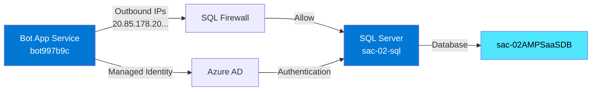

# Infrastructure - Configuration Bot → SaaS Accelerator

## 📋 Vue d'ensemble

Ce dossier contient les fichiers d'infrastructure pour configurer la connexion entre le Bot Teams et la base de données SaaS Accelerator via Azure Managed Identity.

## 📂 Contenu

### Fichiers Bicep

| Fichier | Description | Usage |
|---------|-------------|-------|
| `azure.bicep` | Template principal du Bot | Déploiement initial Bot + identité managée |
| `azure.parameters.json` | Paramètres du Bot | Configuration Bot (OpenAI, suffixe, SKU) |
| `sql-permissions.bicep` | Règles firewall SQL | Configuration réseau Bot → SQL |
| `azure.parameters.sql-permissions.json` | Paramètres firewall | IPs du bot + identité managée |

### Scripts de déploiement

| Script | Description | Quand l'utiliser |
|--------|-------------|------------------|
| `deploy-sql-permissions.sh` | Déploie règles firewall SQL | **Phase 1 - Étape 1** : Premier déploiement ou changement IPs bot |
| `update-bot-app-settings.sh` | Configure variables env bot | **Phase 1 - Étape 3** : Après création utilisateur SQL |

### Fichiers botRegistration/

Module Bicep pour l'enregistrement du Bot Framework (fourni par Teams Toolkit).

## 🚀 Déploiement rapide (Phase 1)

### Option A: Makefile (Recommandé)

```bash
cd infra/
make phase1  # Exécute toutes les étapes automatiquement
```

### Option B: Scripts manuels

```bash
# 1. Générer les paramètres depuis env/.env.dev
./infra/scripts/generate-sql-parameters.sh

# 2. Configurer le firewall SQL
./infra/scripts/deploy-sql-permissions.sh

# 3. Créer l'utilisateur SQL (voir db/migrations/003-bot-managed-identity.sql)
# Via Azure Cloud Shell ou Azure Data Studio

# 4. Configurer les variables d'environnement
./infra/scripts/update-bot-app-settings.sh

# 5. Tester la connexion
node scripts/test-sql-connection.js
```

### ⚠️ Important

Tous les scripts lisent automatiquement `env/.env.dev` pour obtenir :
- Nom du bot : `bot${RESOURCE_SUFFIX}`
- Resource groups
- Serveur SQL et base de données
- Configuration SaaS

**Pas besoin de modifier les scripts !**

## 🔗 Intégration avec M365 Agents Toolkit

### Limitations du lifecycle `provision`

Le M365 Agents Toolkit (`m365agents.yml`) **ne supporte PAS** l'exécution de scripts shell arbitraires dans le lifecycle `provision`. Les actions disponibles sont :

**Actions supportées :**

- ✅ `teamsApp/*` - Création/validation/déploiement d'apps Teams
- ✅ `arm/deploy` - Déploiement de templates ARM/Bicep
- ✅ `aadApp/*` - Gestion Azure AD
- ✅ `botFramework/*` - Enregistrement bot
- ✅ `cli/runNpmCommand` - **Uniquement** commandes npm
- ✅ `azureAppService/zipDeploy` - Déploiement zip vers App Service

**Actions NON supportées :**

- ❌ `cli/runShellScript` - N'existe pas
- ❌ `script/run` - N'existe pas
- ❌ Exécution de scripts bash/shell personnalisés

### Stratégie d'intégration recommandée

**Architecture hybride : M365 Toolkit + Make**

```
┌─────────────────────────────────────────────────────────────┐
│ 1. M365 Agents Toolkit (provision)                         │
│    - Déploie azure.bicep (Bot + Managed Identity)          │
│    - Crée ressources principales                            │
└─────────────────────────────────────────────────────────────┘
                            │
                            ▼
┌─────────────────────────────────────────────────────────────┐
│ 2. Post-provision (make phase1)                            │
│    - Génère azure.parameters.sql-permissions.json           │
│    - Déploie sql-permissions.bicep                          │
│    - Configure SQL user (manuel)                            │
│    - Met à jour App Service settings                        │
└─────────────────────────────────────────────────────────────┘
```

**Workflow complet :**

```bash
# Étape 1: Provision via M365 Agents Toolkit
# (Depuis VS Code: F5 ou Command Palette → Teams: Provision)
# OU en CLI:
teamsapp provision --env local

# Étape 2: Post-provision SaaS Accelerator
cd infra
make phase1
```

### Pourquoi cette séparation ?

| Besoin | M365 Toolkit | Make/Scripts |
|--------|--------------|--------------|
| Déployer Bot + Managed Identity | ✅ `arm/deploy` | ❌ |
| Générer paramètres dynamiques (IPs, Principal ID) | ❌ Requiert `az` CLI | ✅ Bash + `az` |
| Déployer vers **autre resource group** (SaaS Accelerator) | ⚠️ Possible mais complexe | ✅ Makefile clair |
| Exécuter SQL T-SQL | ❌ Impossible | ⚠️ Manuel requis |
| Configurer App Service post-déploiement | ❌ Pas de hook | ✅ `az webapp config` |

### Alternative : Bicep multi-RG dans m365agents.yml

Si vous souhaitez **éviter le Makefile**, vous pouvez déployer les 2 Bicep via `m365agents.yml` :

```yaml
# m365agents.yml
provision:
  # 1. Déploiement principal Bot
  - uses: arm/deploy
    with:
      subscriptionId: ${{AZURE_SUBSCRIPTION_ID}}
      resourceGroupName: ${{AZURE_RESOURCE_GROUP_NAME}}
      templates:
        - path: ./infra/azure.bicep
          parameters: ./infra/azure.parameters.json
          deploymentName: Create-resources-for-bot

  # 2. Déploiement SQL permissions (AUTRE resource group)
  - uses: arm/deploy
    with:
      subscriptionId: ${{AZURE_SUBSCRIPTION_ID}}
      resourceGroupName: rg-saasaccel-teams-gpt-02  # RG du SaaS Accelerator
      templates:
        - path: ./infra/sql-permissions.bicep
          parameters: ./infra/azure.parameters.sql-permissions.json
          deploymentName: sql-permissions-deployment
```

**⚠️ Limitations de cette approche :**

1. **Fichier paramètres SQL statique** : `azure.parameters.sql-permissions.json` doit exister AVANT `provision`
   - Les IPs du bot changent à chaque déploiement → fichier périmé
   - Le Principal ID change si Managed Identity recréée → fichier périmé

2. **Pas de génération dynamique** : Impossible d'appeler `generate-sql-parameters.sh` dans le lifecycle

3. **Étapes manuelles restantes** :
   - ❌ Génération `azure.parameters.sql-permissions.json`
   - ❌ Exécution SQL `CREATE USER`
   - ❌ Configuration App Service post-déploiement

### Recommandation finale

**Garder l'approche hybride actuelle :**

```bash
# Développeurs : Workflow complet
make phase1

# CI/CD : Séparation claire
- teamsapp provision     # Ressources Bot
- make deploy-firewall   # Permissions SQL (post-bot)
- make update-bot-config # Configuration finale
```

**Avantages :**

- ✅ Génération dynamique des paramètres (IPs, Principal ID)
- ✅ Gestion d'erreurs robuste (scripts bash)
- ✅ Séparation concerns (Bot vs SaaS Accelerator)
- ✅ Documentation claire des étapes manuelles
- ✅ Flexibilité pour CI/CD

## 🔧 Paramètres configurés

### azure.bicep (Bot principal)

**Variables d'environnement ajoutées :**

Les valeurs proviennent de `env/.env.dev` via `azure.parameters.json` :

```bicep
SAAS_DB_SERVER               = ${{SAAS_DB_SERVER}}
SAAS_DB_NAME                 = ${{SAAS_DB_NAME}}
SAAS_DB_USE_MANAGED_IDENTITY = ${{SAAS_DB_USE_MANAGED_IDENTITY}}
SAAS_ENABLE_SUBSCRIPTION_CHECK = ${{SAAS_ENABLE_SUBSCRIPTION_CHECK}}
SAAS_DEBUG_MODE              = ${{SAAS_DEBUG_MODE}}
SAAS_PERMISSIVE_MODE         = ${{SAAS_PERMISSIVE_MODE}}
```

M365 Agents Toolkit remplace automatiquement les placeholders `${{}}` lors du déploiement.

### sql-permissions.bicep

**Ressources créées :**

- Règles de firewall SQL pour 7 IPs sortantes du bot
- Règle "AllowAllWindowsAzureIps" pour services Azure

**Inputs requis :**

Les paramètres sont générés dynamiquement par `generate-sql-parameters.sh` depuis `env/.env.dev` et `az` CLI :

| Paramètre | Source | Commande |
|-----------|--------|----------|
| `sqlServerName` | `SAAS_DB_SERVER` (env/.env.dev) | Extrait de `sac-02-sql.database.windows.net` |
| `botOutboundIpAddresses` | Azure CLI | `az webapp show --query outboundIpAddresses` |
| `botManagedIdentityPrincipalId` | Azure CLI | `az identity show --query principalId` |
| `botManagedIdentityName` | `RESOURCE_SUFFIX` (env/.env.dev) | `bot${RESOURCE_SUFFIX}` |

## 📊 Diagramme d'architecture



## 🔍 Vérification post-déploiement

### Firewall SQL

```bash
az sql server firewall-rule list \
  --server sac-02-sql \
  --resource-group rg-saasaccel-teams-gpt-02 \
  --output table
```

**Attendu :** 8+ règles incluant `AllowBotAppService-IP-*`

### Variables d'environnement Bot

```bash
az webapp config appsettings list \
  --name bot997b9c \
  --resource-group rg-saas-test \
  --query "[?contains(name, 'SAAS')]" \
  --output table
```

**Attendu :** 8 variables SAAS_*

### Utilisateur SQL

```sql
SELECT name, type_desc FROM sys.database_principals WHERE name = 'bot997b9c';
```

**Attendu :** 1 ligne avec type_desc = 'EXTERNAL_USER'

## 🐛 Résolution de problèmes

### Erreur : "Bicep validation failed"

**Cause :** Template Bicep invalide ou paramètres manquants

**Solution :**

```bash
# Valider template uniquement
az deployment group validate \
  --resource-group rg-saasaccel-teams-gpt-02 \
  --template-file infra/sql-permissions.bicep \
  --parameters @infra/azure.parameters.sql-permissions.json
```

### Erreur : "Login failed for user 'bot997b9c'"

**Cause :** Utilisateur SQL non créé ou permissions manquantes

**Solution :**

Vérifier utilisateur existe :

```sql
SELECT * FROM sys.database_principals WHERE name = 'bot997b9c';
```

Si absent, exécuter `db/migrations/003-bot-managed-identity.sql`

### Erreur : "Connection timeout"

**Cause :** Firewall SQL ne permet pas les connexions du bot

**Solution :**

Vérifier IPs du bot :

```bash
az webapp show --name bot997b9c --resource-group rg-saas-test \
  --query "outboundIpAddresses" -o tsv
```

Comparer avec règles firewall et re-déployer `sql-permissions.bicep` si IPs différentes

### Erreur : "Environment variable SAAS_DB_SERVER not found"

**Cause :** Variables d'environnement non configurées ou bot non redémarré

**Solution :**

```bash
# Redémarrer le bot
az webapp restart --name bot997b9c --resource-group rg-saas-test

# Attendre 30 secondes puis vérifier logs
az webapp log tail --name bot997b9c --resource-group rg-saas-test
```

## 📚 Ressources complémentaires

- [Guide complet Phase 1](/doc/guides/phase1-sql-setup.md)
- [Migration SQL 003](/db/migrations/003-bot-managed-identity.sql)
- [Script de test connexion](/scripts/test-sql-connection.js)
- [Issue #11 - Architecture complète](https://github.com/michel-heon/teams-gpt-saas-acc/issues/11)

## 🔄 Mise à jour des IPs du bot

Si le bot est redéployé ou change de région, les IPs sortantes peuvent changer.

**Procédure :**

```bash
# 1. Récupérer nouvelles IPs
NEW_IPS=$(az webapp show --name bot997b9c --resource-group rg-saas-test \
  --query "outboundIpAddresses" -o tsv | tr ',' ',')

# 2. Mettre à jour azure.parameters.sql-permissions.json
# (Éditer manuellement ou via script)

# 3. Re-déployer firewall
./infra/deploy-sql-permissions.sh
```

## 📋 Conformité SaaS Accelerator

Cette implémentation suit les [Security Best Practices](../Commercial-Marketplace-SaaS-Accelerator/docs/Security-Best-Practices.md) du SaaS Accelerator :

### ✅ Bonnes pratiques implémentées

- **Azure Managed Identity** : Authentification sans mot de passe entre Bot et SQL
- **Firewall SQL** : Règles pour IPs sortantes du bot + services Azure
- **Separation of Concerns** : Resource Groups séparés (Bot vs SaaS Accelerator)
- **Environment Variables** : Configuration via App Settings (pas de secrets hardcodés)

### ⚠️ Bonnes pratiques recommandées (non implémentées en Phase 1)

**Production Hardening :**

- **Private Link** : Remplacer firewall IP par Private Endpoint pour SQL
- **Transparent Data Encryption** : Vérifier activation TDE sur `sac-02-sql`
- **Application Insights** : Activer monitoring et alertes sur connexions SQL

**Note sur la gestion des secrets :**

Le projet utilise **Azure AD Managed Identity** pour l'authentification SQL (implémenté ✅) et **App Service App Settings** pour les clés API (`AZURE_OPENAI_KEY`). 

La recommandation Key Vault du SaaS Accelerator s'applique à leurs portails web (communication App Service ↔ Key Vault). Pour notre architecture Bot, la combinaison Managed Identity (SQL) + App Settings (API keys) est un choix architectural valide et simplifié.

**Référence :** [Security-Best-Practices.md](../Commercial-Marketplace-SaaS-Accelerator/docs/Security-Best-Practices.md)

## ✅ Checklist déploiement

Phase 1 Infrastructure complète :

- [ ] Fichiers Bicep créés (`sql-permissions.bicep`)
- [ ] Paramètres configurés (`azure.parameters.sql-permissions.json`)
- [ ] Script déploiement exécuté (`deploy-sql-permissions.sh`)
- [ ] Migration SQL exécutée (`003-bot-managed-identity.sql`)
- [ ] Variables env configurées (`update-bot-app-settings.sh`)
- [ ] Bot redémarré
- [ ] Test connexion réussi (`test-sql-connection.js`)
- [ ] Logs bot affichent "Successfully connected"

**Version :** 1.0  
**Date :** 12 novembre 2025  
**Maintenance :** Vérifier IPs du bot mensuellement
